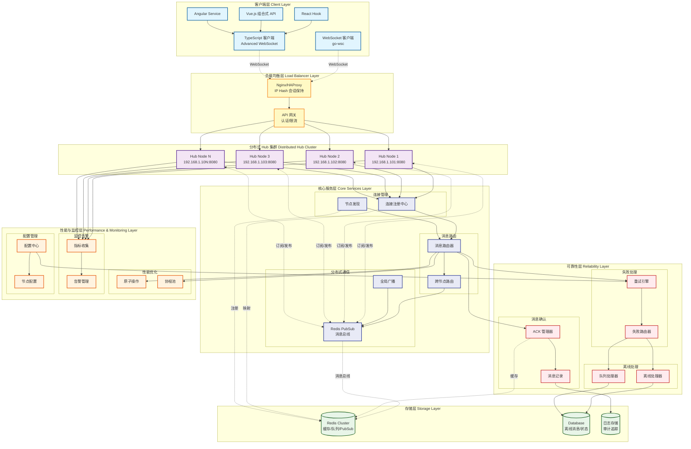

# Go WebSocket Client (go-wsc) 🚀

[](https://opensource.org/licenses/MIT)
[](https://github.com/kamalyes/go-wsc)
[](https://github.com/kamalyes/go-wsc/releases)
[](https://goreportcard.com/report/github.com/kamalyes/go-wsc)
[](https://pkg.go.dev/github.com/kamalyes/go-wsc?tab=doc)
[](https://github.com/kamalyes/go-wsc/issues)
[](https://github.com/kamalyes/go-wsc/stargazers)
[](https://codecov.io/gh/kamalyes/go-wsc)

**go-wsc** 是一个企业级 Go WebSocket 框架，专注于高性能实时通信。提供智能重连、消息确认(ACK)、连接池管理等关键特性，支持百万级并发连接。

## 🏗️ 系统架构



### 架构特点

- **分布式集群**: 多节点 Hub 集群 + Redis PubSub 消息总线 + 自动节点发现
- **负载均衡**: Nginx/HAProxy IP Hash 会话保持 + 智能流量分发
- **跨节点通信**: 
  - 同节点通信: 内存直达，延迟 < 1ms
  - 跨节点通信: Redis PubSub，延迟 5-10ms
  - 全局广播: 自动同步到所有节点
- **高可靠性**: ACK 确认机制 + 消息记录 + 离线处理 + 智能重试
- **失败处理**: 5类专业化失败处理器 + go-toolbox重试引擎
- **配置统一**: go-config/wsc 统一管理重试参数、错误分类和节点配置
- **高性能**: 原子操作 + 动态队列 + 协程池优化  
- **可观测**: 全链路监控 + 实时告警 + 可视化面板
- **水平扩展**: 无状态设计 + 弹性伸缩 + 节点自动注册/心跳
- **高可用**: 节点故障自动恢复 + 客户端自动重连 + 会话保持

## ✨ 核心特性

### 🎯 客户端能力

- **智能重连**：指数退避 + 抖动算法
- **消息类型**：文本/二进制/Ping/Pong等103种
- **状态管理**：连接生命周期跟踪
- **缓冲机制**：可配置消息队列

### 🏢 服务端能力  

- **高并发**：百万级连接支持
- **消息路由**：点对点/群组/广播
- **ACK 确认**：可靠消息传输
- **性能监控**：实时指标统计

### 🔄 失败处理与重试

- **智能重试**：基于 go-toolbox 的重试引擎，支持指数退避
- **失败分类**：5类专业化失败处理器（通用/队列满/离线/连接错误/超时）
- **配置驱动**：通过 go-config/wsc 统一管理重试参数
- **详细记录**：完整的重试尝试历史和性能指标

### 📊 配置管理

- **统一配置**：go-config/wsc 包统一管理所有 WebSocket 相关配置
- **重试参数**：MaxRetries、BaseDelay、BackoffFactor 灵活配置
- **错误分类**：RetryableErrors 和 NonRetryableErrors 智能分类
- **热更新**：支持运行时配置更新和生效

## 📚 文档导航

### 📖 核心文档

- [📦 安装配置](#-安装) - 依赖和环境要求
- [🚀 快速开始](#-快速开始) - 5分钟上手指南
- [⚡ 性能表现](#-性能表现) - 基准测试结果

### 🔧 集成指南  

- [🎯 TypeScript 前端集成](./docs/TypeScript_Integration.md) - React/Vue/Angular 示例
- [☕ Java 客户端集成](./docs/Java_Client_Integration.md) - 企业级 Java 客户端实现
- [📡 ACK 消息确认机制](./docs/ACK_Mechanism.md) - 可靠消息传输
- [🔄 失败处理与重试机制](./docs/Failure_Handling.md) - 全面的失败处理策略
- [🏗️ 架构设计文档](./docs/Architecture_Design.md) - 回调与失败机制架构
- [📊 性能优化指南](./docs/Performance_Guide.md) - 调优和监控

### 📋 API 参考

- [🔌 客户端 API](./docs/Client_API.md) - 完整接口说明  
- [🏢 服务端 Hub API](./docs/Hub_API.md) - Hub 管理接口与失败处理器
- [🧪 测试覆盖报告](./docs/Test_Coverage.md) - 测试用例和覆盖率

## 📦 安装

```bash
go get github.com/kamalyes/go-wsc
```

**系统要求：** Go 1.20+ | 支持 Linux/Windows/macOS

## 🚀 快速开始

### 🎮 交互式演示（推荐）

最快的上手方式！运行完整的交互式 demo，体验客户端和服务端的实时通信：

```bash
# 1. 启动演示服务器
cd examples/demo
go run server.go
```

**演示特点**:
- ✅ 服务端自动发送欢迎消息
- ✅ 服务端回复客户端消息
- ✅ 完整的双向通信流程

### 完整示例代码

所有示例代码都在 `examples/` 目录中，可以直接运行：

> - **[examples/demo](./examples/demo/server.go)** - 🎮 交互式演示（推荐从这里开始！）
> - **[examples/basic-client](./examples/basic-client/main.go)** - 基础 WebSocket 客户端
> - **[examples/basic-server](./examples/basic-server/main.go)** - 基础 WebSocket 服务端
> - **[examples/distributed-server](./examples/distributed-server/main.go)** - 分布式服务端
> - **[examples/message-send](./examples/message-send/main.go)** - 各种消息发送模式
> - **[examples/README.md](./examples/README.md)** - 详细说明请查看：

📖 **详细文档**: 
> - [分布式架构](./docs/DISTRIBUTED_ARCHITECTURE.md) - 多节点集群部署
> - [K8s 部署](./docs/K8S_DEPLOYMENT.md) - Kubernetes 环境部署
> - [客户端 API](./docs/Client_API.md) - 完整接口说明
> - [服务端 Hub API](./docs/Hub_API.md) - Hub 管理接口

## ⚡ 性能表现

- **吞吐量**: 720万条消息/秒
- **客户端注册**: ~2,430 ns/op  
- **消息发送**: ~138 ns/op
- **并发连接**: 百万级支持

> 📊 **详细分析**: 查看 [性能优化指南](./docs/Performance_Guide.md) 获取调优建议

## 🧪 测试与质量

### 测试覆盖

- **测试用例**: 368个
- **通过率**: 100%
- **覆盖范围**: 单元测试 + 集成测试 + 竞态检测
- **基准测试**: 性能回归保护

### 持续集成

```bash
# 运行所有测试
go test ./... -v

# 运行基准测试
go test -bench=. -benchmem

# 竞态检测
go test -race ./...

# 生成覆盖报告
go test -coverprofile=coverage.out ./...
go tool cover -html=coverage.out
go test -v ./... -timeout 5m 2>&1 | Select-String -Pattern "(FAIL|ERROR|panic)" -Context 1,0
```

> 📋 **测试报告**: 查看 [测试覆盖报告](./docs/Test_Coverage.md) 了解详细测试情况

## 💼 企业特性

### 生产环境支持

- **监控集成**: Prometheus/Grafana 指标导出
- **日志标准**: 结构化日志 (JSON) 输出
- **优雅关闭**: 平滑连接迁移和资源清理
- **健康检查**: HTTP 端点支持负载均衡器探测

### 分布式架构

- **零侵入部署**: 现有代码无需修改，自动支持分布式
- **节点发现**: 自动服务注册、心跳检测和节点发现
- **智能路由**: 
  - 同节点通信: 内存直达，延迟 < 1ms
  - 跨节点通信: Redis PubSub，延迟 5-10ms
  - 自动路由到用户所在节点
- **全局广播**: 自动同步到所有节点的所有客户端
- **会话保持**: Nginx IP Hash 保证用户连接稳定性
- **故障转移**: 节点故障自动检测和客户端自动重连
- **水平扩展**: 无状态设计支持弹性伸缩，线性扩展并发能力
- **高可用**: 多节点冗余 + 自动故障恢复 + 负载均衡

> 📘 **详细文档**: 查看 [分布式架构指南](./docs/DISTRIBUTED_ARCHITECTURE.md) 和 [K8s 部署指南](./docs/K8S_DEPLOYMENT.md)

## 🤝 社区与支持

### 获取帮助

- **问题报告**: [GitHub Issues](https://github.com/kamalyes/go-wsc/issues)
- **功能请求**: [GitHub Discussions](https://github.com/kamalyes/go-wsc/discussions)

### 贡献指南

1. Fork 项目并创建特性分支
2. 添加测试用例确保代码质量
3. 更新文档说明变更内容
4. 提交 Pull Request 等待代码审查

## 📄 许可证

本项目采用 [MIT 许可证](LICENSE) 开源。

## 📌 Commit Emoji 图例

在本项目的提交记录中，我们使用以下 emoji 标记不同类型的变更：

| Emoji | 类型 | 说明 |
|-------|------|------|
| 🔥 | feat | 新增功能或重大重构 |
| 🐛 | fix | Bug 修复 |
| ➕ | add | 添加新模块/文件 |
| 📊 | data | 连接记录、数据持久化 |
| 📈 | stats | 统计信息、监控指标 |
| 📮 | queue | 消息队列相关 |
| 💾 | database | 数据库、GORM 相关 |
| 📦 | storage | 离线消息、存储层 |
| 🟢 | status | 在线状态管理 |
| ⚖️ | balance | 负载管理、负载均衡 |
| 🗑️ | remove | 移除文件、清理代码 |
| ✅ | test | 修复测试、测试相关 |
| ⚡ | perf | 性能优化 |
| 📝 | docs | 文档更新 |
| 🎨 | style | 代码格式、样式调整 |
| ♻️ | refactor | 代码重构 |
| 🔒 | security | 安全相关 |
| 🚀 | deploy | 部署、发布相关 |

---

**⭐ 如果这个项目对你有帮助，请给个 Star 支持一下！**
