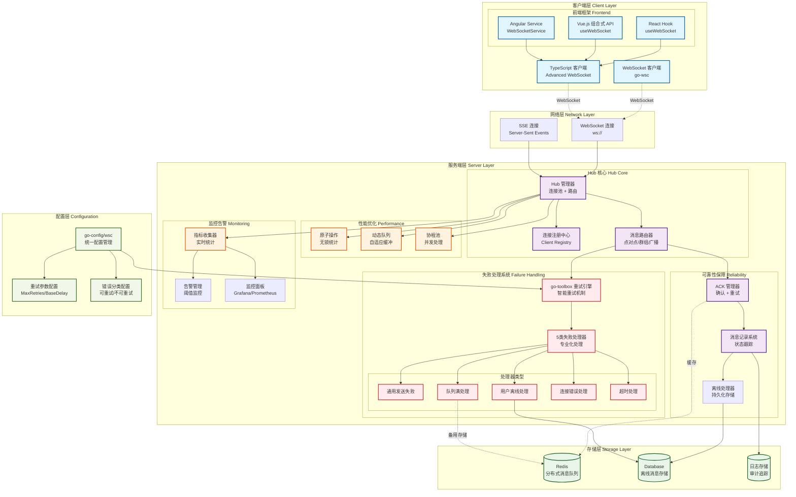

# Go WebSocket Client (go-wsc) 🚀

[](https://opensource.org/licenses/MIT)
[](https://github.com/kamalyes/go-wsc)
[](https://github.com/kamalyes/go-wsc/releases)
[](https://goreportcard.com/report/github.com/kamalyes/go-wsc)
[](https://pkg.go.dev/github.com/kamalyes/go-wsc?tab=doc)
[](https://github.com/kamalyes/go-wsc/issues)
[](https://github.com/kamalyes/go-wsc/stargazers)
[](https://codecov.io/gh/kamalyes/go-wsc)

**go-wsc** 是一个企业级 Go WebSocket 框架，专注于高性能实时通信。提供智能重连、消息确认(ACK)、连接池管理等关键特性，支持百万级并发连接。

## 📦 项目结构

```
go-wsc/
├── client/          # WebSocket客户端封装
│   ├── websocket.go # 核心WebSocket连接(Getter方法、线程安全)
│   ├── wsc.go       # 客户端逻辑(回调检测、重连机制)
│   ├── connection.go# 连接管理
│   └── aliases.go   # 类型别名
├── hub/            # 服务端核心(模块化拆分)
│   ├── hub.go      # Hub核心结构
│   ├── send.go     # 消息发送与重试
│   ├── ack.go      # ACK确认机制
│   ├── batch_sender.go # 批量发送器
│   ├── broadcast.go    # 广播逻辑
│   ├── query.go        # 查询接口
│   ├── registry.go     # 注册管理
│   ├── lifecycle.go    # 生命周期
│   ├── handlers.go     # 消息处理
│   ├── callbacks.go    # 回调管理
│   ├── sse.go          # SSE支持
│   ├── vip.go          # VIP管理
│   ├── utils.go        # 工具函数
│   ├── context.go      # 上下文
│   └── repository.go   # 仓库集成
├── models/         # 数据模型层
│   ├── message.go      # 消息模型
│   ├── message_record.go  # 消息记录
│   ├── offline_message.go # 离线消息
│   ├── connection.go   # 连接模型
│   ├── enums.go        # 枚举定义
│   ├── message_type.go # 消息类型
│   ├── types.go        # 核心类型
│   ├── templates.go    # 模板
│   ├── errors.go       # 错误定义
│   └── validator.go    # 验证器
├── repository/     # 数据访问层
│   ├── message_record_repository.go
│   ├── offline_message_repository.go
│   ├── online_status_repository.go
│   ├── connection_repository.go
│   ├── message_queue_repository.go
│   ├── hub_stats_repository.go
│   ├── workload_repository.go
│   └── aliases.go
├── handler/        # 业务逻辑层
│   ├── offline_message.go  # 离线消息处理
│   └── aliases.go
├── middleware/     # 中间件层
│   ├── logger.go
│   ├── rate_limiter.go
│   └── rate_limit_alert.go
├── protocol/       # 协议层
│   └── ack.go
└── exports_*.go    # 向后兼容导出(7个文件)
```

### 架构特点

- **模块化设计**: 从单体4885行重构为6大核心模块
- **职责清晰**: handler(业务逻辑) vs repository(数据访问) 明确分离
- **完整封装**: 30+公共方法，测试代码零私有字段访问
- **向后兼容**: exports文件保证老代码平滑迁移
- **线程安全**: Getter方法使用mutex保护并发访问

## 🏗️ 系统架构



### 架构特点

- **分层设计**: 客户端层 → 网络层 → 服务端层 → 配置层 → 存储层
- **高可靠性**: ACK 确认机制 + 消息记录 + 离线处理 + 智能重试
- **失败处理**: 5类专业化失败处理器 + go-toolbox重试引擎
- **配置统一**: go-config/wsc 统一管理重试参数和错误分类
- **高性能**: 原子操作 + 动态队列 + 协程池优化  
- **可观测**: 全链路监控 + 实时告警 + 可视化面板
- **可扩展**: 分布式架构 + 水平扩展支持

## ✨ 核心特性

### 🎯 客户端能力

- **智能重连**：指数退避 + 抖动算法
- **消息类型**：文本/二进制/Ping/Pong
- **状态管理**：连接生命周期跟踪
- **缓冲机制**：可配置消息队列

### 🏢 服务端能力  

- **高并发**：百万级连接支持
- **消息路由**：点对点/群组/广播
- **ACK 确认**：可靠消息传输
- **性能监控**：实时指标统计

### 🔄 失败处理与重试

- **智能重试**：基于 go-toolbox 的重试引擎，支持指数退避
- **失败分类**：5类专业化失败处理器（通用/队列满/离线/连接错误/超时）
- **配置驱动**：通过 go-config/wsc 统一管理重试参数
- **详细记录**：完整的重试尝试历史和性能指标

### 📊 配置管理

- **统一配置**：go-config/wsc 包统一管理所有 WebSocket 相关配置
- **重试参数**：MaxRetries、BaseDelay、BackoffFactor 灵活配置
- **错误分类**：RetryableErrors 和 NonRetryableErrors 智能分类
- **热更新**：支持运行时配置更新和生效

## 📚 文档导航

### 📖 核心文档

- [🚀 快速开始](#-快速开始) - 5分钟上手指南
- [📦 安装配置](#-安装) - 依赖和环境要求
- [⚡ 性能表现](#-性能表现) - 基准测试结果

### 🔧 集成指南  

- [🎯 TypeScript 前端集成](./docs/TypeScript_Integration.md) - React/Vue/Angular 示例
- [☕ Java 客户端集成](./docs/Java_Client_Integration.md) - 企业级 Java 客户端实现
- [📡 ACK 消息确认机制](./docs/ACK_Mechanism.md) - 可靠消息传输
- [🔄 失败处理与重试机制](./docs/Failure_Handling.md) - 全面的失败处理策略
- [🏗️ 架构设计文档](./docs/Architecture_Design.md) - 回调与失败机制架构
- [📊 性能优化指南](./docs/Performance_Guide.md) - 调优和监控

### 📋 API 参考

- [🔌 客户端 API](./docs/Client_API.md) - 完整接口说明  
- [🏢 服务端 Hub API](./docs/Hub_API.md) - Hub 管理接口与失败处理器
- [🧪 测试覆盖报告](./docs/Test_Coverage.md) - 测试用例和覆盖率

## 📦 安装

```bash
go get github.com/kamalyes/go-wsc
```

**系统要求：** Go 1.20+ | 支持 Linux/Windows/macOS

## 🚀 快速开始

### 基础客户端 (5分钟上手)

```go
package main

import (
    "fmt"
    "log"
    "github.com/kamalyes/go-wsc"
)

func main() {
    // 1. 创建客户端
    client := wsc.NewWsc("ws://localhost:8080/ws")
    
    // 2. 设置回调处理
    client.OnConnected(func() {
        fmt.Println("✅ 连接成功")
    })
    
    client.OnTextMessage(func(message string) {
        fmt.Printf("📨 收到消息: %s\n", message)
    })
    
    client.OnDisconnected(func(err error) {
        log.Printf("❌ 连接断开: %v\n", err)
    })
    
    // 3. 连接并发送消息
    if err := client.Connect(); err != nil {
        log.Fatal(err)
    }
    
    client.SendText("Hello WebSocket!")
    
    select {} // 保持运行
}
```

### 基础服务端

```go
package main

import (
    "log"
    "net/http"
    
    "github.com/kamalyes/go-wsc"
    "github.com/kamalyes/go-wsc/middleware"
)

func main() {
    // 1. 创建Hub并配置中间件
    logger := middleware.NewDefaultWSCLogger()
    hub := wsc.NewHub(
        wsc.WithLogger(logger),
        wsc.WithMessageBufferSize(256),
    )
    
    // 2. 设置回调处理
    hub.OnClientConnected(func(conn *wsc.Connection) {
        log.Printf("👤 客户端连接: %s\n", conn.GetUserID())
    })
    
    hub.OnClientDisconnected(func(conn *wsc.Connection) {
        log.Printf("👋 客户端断开: %s\n", conn.GetUserID())
    })
    
    hub.OnMessageReceived(func(conn *wsc.Connection, msg *wsc.HubMessage) {
        log.Printf("📨 收到消息: %s -> %s\n", conn.GetUserID(), msg.Content)
    })
    
    // 3. 启动Hub
    go hub.Run()
    defer hub.Shutdown()
    
    // 4. 配置HTTP路由
    http.HandleFunc("/ws", func(w http.ResponseWriter, r *http.Request) {
        userID := r.URL.Query().Get("user_id")
        if userID == "" {
            http.Error(w, "缺少user_id参数", http.StatusBadRequest)
            return
        }
        wsc.ServeWs(hub, w, r, userID)
    })
    
    log.Println("🚀 服务器启动: http://localhost:8080")
    if err := http.ListenAndServe(":8080", nil); err != nil {
        log.Fatal(err)
    }
}
```

### 消息发送与广播

```go
// 发送给单个用户
func sendToUser(hub *wsc.Hub, userID string, content string) {
    msg := &wsc.HubMessage{
        Type:    wsc.TextMessage,
        Content: content,
    }
    hub.SendToUser(userID, msg)
}

// 批量发送
func batchSend(hub *wsc.Hub) {
    sender := hub.NewBatchSender().
        SetBeforeSendCallback(func(userID string, msg *wsc.HubMessage) {
            log.Printf("准备发送: %s -> %s\n", userID, msg.ID)
        }).
        SetAfterSendCallback(func(userID string, msg *wsc.HubMessage, err error) {
            if err != nil {
                log.Printf("发送失败: %s -> %s: %v\n", userID, msg.ID, err)
            }
        })
    
    // 添加消息
    sender.AddMessage("user1", &wsc.HubMessage{Type: wsc.TextMessage, Content: "Hello User1"})
    sender.AddMessage("user2", &wsc.HubMessage{Type: wsc.TextMessage, Content: "Hello User2"})
    
    // 执行发送
    sender.Send()
}

// 广播消息
func broadcast(hub *wsc.Hub, content string) {
    msg := &wsc.HubMessage{
        Type:    wsc.TextMessage,
        Content: content,
    }
    hub.Broadcast(msg)
}

// 发送给用户组
func sendToGroup(hub *wsc.Hub, userIDs []string, content string) {
    msg := &wsc.HubMessage{
        Type:    wsc.TextMessage,
        Content: content,
    }
    hub.SendToMultipleUsers(userIDs, msg)
}
```

### 带ACK确认的可靠消息

```go
// 发送需要ACK确认的消息
func sendWithAck(hub *wsc.Hub, userID string, content string) {
    msg := &wsc.HubMessage{
        Type:    wsc.TextMessage,
        Content: content,
    }
    
    // 发送并等待ACK
    err := hub.SendToUserWithAck(userID, msg, 5*time.Second)
    if err != nil {
        log.Printf("❌ 消息未确认: %v\n", err)
        // 自动存储到离线消息
    } else {
        log.Printf("✅ 消息已确认\n")
    }
}

// 客户端确认消息
func clientAckHandler(client *wsc.Wsc) {
    client.OnTextMessage(func(message string) {
        // 解析消息
        var msg wsc.HubMessage
        if err := json.Unmarshal([]byte(message), &msg); err != nil {
            return
        }
        
        // 如果需要ACK，发送确认
        if msg.RequireAck {
            ackMsg := wsc.CreateAckResponse(msg.ID)
            client.SendMessage(ackMsg)
        }
        
        // 处理业务逻辑
        handleBusinessLogic(&msg)
    })
}
```

### 离线消息处理

```go
// 配置离线消息处理器
func setupOfflineHandler(hub *wsc.Hub) {
    // 使用Redis+MySQL混合存储
    offlineHandler := wsc.NewHybridOfflineMessageHandler(
        redisClient,
        database,
        middleware.NewDefaultWSCLogger(),
    )
    
    hub.SetOfflineMessageHandler(offlineHandler)
}

// 用户上线后推送离线消息
func pushOfflineMessages(hub *wsc.Hub, userID string) {
    messages, err := hub.GetOfflineMessages(userID, 100)
    if err != nil {
        log.Printf("获取离线消息失败: %v\n", err)
        return
    }
    
    for _, msg := range messages {
        hub.SendToUser(userID, msg)
    }
    
    // 标记为已推送
    hub.MarkOfflineMessagesAsPushed(userID, getMessageIDs(messages))
}
```

> 💡 **深入学习**: 查看 [客户端API文档](./docs/Client_API.md) 和 [Hub API文档](./docs/Hub_API.md)

## ⚡ 性能表现

### 基准测试结果

- **吞吐量**: 720万条消息/秒
- **客户端注册**: ~2,430 ns/op  
- **消息发送**: ~138 ns/op
- **并发连接**: 百万级支持

### 关键优化

- **原子操作**: 无锁统计和状态管理
- **动态队列**: 自适应缓冲区大小调整
- **协程池**: 高效的并发消息处理
- **内存池**: 减少 GC 压力的对象重用

> 📊 **详细分析**: 查看 [性能优化指南](./docs/Performance_Guide.md) 获取调优建议

## 🔧 高级配置

### 客户端配置

```go
import (
    "time"
    "github.com/kamalyes/go-wsc/client"
)

// 创建自定义配置的客户端
ws := client.NewWebSocket(
    "ws://localhost:8080/ws",
    client.WithWriteWait(10*time.Second),
    client.WithPongWait(60*time.Second),
    client.WithPingPeriod(54*time.Second),
    client.WithMaxMessageSize(1024*1024), // 1MB
    client.WithSendChanSize(512),
)

// 使用Wsc包装器
wscClient := client.NewWsc(ws)

// 配置自动重连
wscClient.SetAutoReconnect(true)
wscClient.SetReconnectConfig(
    1*time.Second,  // 最小重连间隔
    30*time.Second, // 最大重连间隔
    2.0,           // 退避因子
)

// 设置完整回调
wscClient.OnConnected(func() {
    log.Println("✅ 已连接")
})

wscClient.OnConnectError(func(err error) {
    log.Printf("❌ 连接错误: %v\n", err)
})

wscClient.OnDisconnected(func(err error) {
    log.Printf("👋 断开连接: %v\n", err)
})

wscClient.OnReconnecting(func(attempt int, delay time.Duration) {
    log.Printf("🔄 重连中 (第%d次, 延迟%v)\n", attempt, delay)
})

wscClient.OnClose(func(code int, text string) {
    log.Printf("🚪 连接关闭: %d - %s\n", code, text)
})

// 消息处理
wscClient.OnTextMessage(func(msg string) {
    log.Printf("📨 文本消息: %s\n", msg)
})

wscClient.OnBinaryMessage(func(data []byte) {
    log.Printf("📦 二进制消息: %d bytes\n", len(data))
})
```

### 服务端配置

```go
import (
    "github.com/kamalyes/go-wsc/hub"
    "github.com/kamalyes/go-wsc/middleware"
    "github.com/kamalyes/go-wsc/repository"
    "github.com/kamalyes/go-wsc/handler"
)

func setupHub() *hub.Hub {
    // 1. 创建日志器
    logger := middleware.NewDefaultWSCLogger()
    
    // 2. 创建仓库
    redisClient := createRedisClient()
    db := createDatabaseConnection()
    
    onlineStatusRepo := repository.NewRedisOnlineStatusRepository(redisClient, logger)
    messageRecordRepo := repository.NewRedisMessageRecordRepository(redisClient, logger)
    workloadRepo := repository.NewRedisWorkloadRepository(redisClient, logger)
    messageQueueRepo := repository.NewRedisMessageQueueRepository(redisClient, logger)
    offlineMessageRepo := repository.NewMySQLOfflineMessageRepository(db, logger)
    
    // 3. 创建离线消息处理器
    offlineHandler := handler.NewHybridOfflineMessageHandler(
        redisClient,
        db,
        logger,
        handler.WithMaxOfflineMessages(1000),
        handler.WithTTL(7*24*time.Hour),
    )
    
    // 4. 创建Hub
    h := hub.New(
        logger,
        onlineStatusRepo,
        messageRecordRepo,
        workloadRepo,
        messageQueueRepo,
        offlineMessageRepo,
        hub.WithMessageBufferSize(512),
        hub.WithWriteWait(10*time.Second),
        hub.WithPongWait(60*time.Second),
        hub.WithPingPeriod(54*time.Second),
        hub.WithMaxMessageSize(1024*1024),
    )
    
    // 5. 设置离线消息处理器
    h.SetOfflineMessageHandler(offlineHandler)
    
    // 6. 配置回调
    setupHubCallbacks(h)
    
    return h
}

func setupHubCallbacks(h *hub.Hub) {
    // 客户端连接回调
    h.OnClientConnected(func(conn *hub.Connection) {
        userID := conn.GetUserID()
        log.Printf("👤 用户上线: %s\n", userID)
        
        // 推送离线消息
        go pushOfflineMessages(h, userID)
    })
    
    // 客户端断开回调
    h.OnClientDisconnected(func(conn *hub.Connection) {
        userID := conn.GetUserID()
        log.Printf("👋 用户离线: %s\n", userID)
    })
    
    // 消息接收回调
    h.OnMessageReceived(func(conn *hub.Connection, msg *hub.HubMessage) {
        log.Printf("📨 收到消息: %s -> %s\n", conn.GetUserID(), msg.ID)
    })
    
    // 消息发送成功回调
    h.OnMessageSent(func(userID string, msg *hub.HubMessage) {
        log.Printf("✅ 消息已送达: %s -> %s\n", userID, msg.ID)
    })
    
    // 消息发送失败回调
    h.OnMessageSendFailed(func(userID string, msg *hub.HubMessage, err error) {
        log.Printf("❌ 消息发送失败: %s -> %s: %v\n", userID, msg.ID, err)
    })
}
```

### ACK消息确认配置

```go
// 服务端发送需要ACK的消息
func sendWithAck(h *hub.Hub, userID string, content string) {
    msg := &hub.HubMessage{
        Type:       hub.TextMessage,
        Content:    content,
        RequireAck: true,
    }
    
    // 带超时的ACK发送
    ctx, cancel := context.WithTimeout(context.Background(), 10*time.Second)
    defer cancel()
    
    err := h.SendToUserWithAck(ctx, userID, msg)
    if err != nil {
        log.Printf("❌ ACK超时或失败: %v\n", err)
        // 自动存储到离线消息
    } else {
        log.Printf("✅ 消息已确认\n")
    }
}

// 客户端自动ACK
wscClient.OnTextMessage(func(message string) {
    var msg hub.HubMessage
    if err := json.Unmarshal([]byte(message), &msg); err != nil {
        return
    }
    
    // 自动发送ACK
    if msg.RequireAck {
        ackMsg := protocol.CreateAckMessage(msg.ID)
        wscClient.SendMessage(ackMsg)
    }
    
    // 处理消息
    handleMessage(&msg)
})
```

### 批量发送配置

```go
// 创建批量发送器
sender := h.NewBatchSender()

// 配置回调
sender.SetBeforeSendCallback(func(userID string, msg *hub.HubMessage) {
    log.Printf("⏩ 准备发送: %s\n", msg.ID)
})

sender.SetAfterSendCallback(func(userID string, msg *hub.HubMessage, err error) {
    if err != nil {
        log.Printf("❌ 发送失败: %s: %v\n", msg.ID, err)
        // 记录失败信息
    } else {
        log.Printf("✅ 发送成功: %s\n", msg.ID)
    }
})

// 添加消息
for _, user := range userList {
    msg := &hub.HubMessage{
        Type:    hub.TextMessage,
        Content: fmt.Sprintf("通知给 %s", user),
    }
    sender.AddMessage(user, msg)
}

// 批量添加
messages := map[string]*hub.HubMessage{
    "user1": {Type: hub.TextMessage, Content: "Hello User1"},
    "user2": {Type: hub.TextMessage, Content: "Hello User2"},
    "user3": {Type: hub.TextMessage, Content: "Hello User3"},
}
sender.AddMessages(messages)

// 配置超时并发送
sender.SetTimeout(5 * time.Second)
sender.Send()
```

> 🔗 **深入了解**: 查看 [ACK 消息确认机制](./docs/ACK_Mechanism.md) 了解可靠消息传输

## 🧪 测试与质量

### 测试覆盖

- **测试用例**: 368个
- **通过率**: 100%
- **覆盖范围**: 单元测试 + 集成测试 + 竞态检测
- **基准测试**: 性能回归保护

### 持续集成

```bash
# 运行所有测试
go test ./... -v

# 运行基准测试
go test -bench=. -benchmem

# 竞态检测
go test -race ./...

# 生成覆盖报告
go test -coverprofile=coverage.out ./...
go tool cover -html=coverage.out
go test -v ./... -timeout 5m 2>&1 | Select-String -Pattern "(FAIL|ERROR|panic)" -Context 1,0
```

> 📋 **测试报告**: 查看 [测试覆盖报告](./docs/Test_Coverage.md) 了解详细测试情况

## 💼 企业特性

### 生产环境支持

- **监控集成**: Prometheus/Grafana 指标导出
- **日志标准**: 结构化日志 (JSON) 输出
- **优雅关闭**: 平滑连接迁移和资源清理
- **健康检查**: HTTP 端点支持负载均衡器探测

### 分布式架构

- **节点发现**: 自动服务发现和负载均衡
- **消息路由**: 跨节点消息传递和状态同步  
- **故障转移**: 自动故障检测和流量切换
- **水平扩展**: 无状态设计支持弹性伸缩

## 🤝 社区与支持

### 获取帮助

- **问题报告**: [GitHub Issues](https://github.com/kamalyes/go-wsc/issues)
- **功能请求**: [GitHub Discussions](https://github.com/kamalyes/go-wsc/discussions)
- **安全问题**: [security@example.com](mailto:security@example.com)

### 贡献指南

1. Fork 项目并创建特性分支
2. 添加测试用例确保代码质量
3. 更新文档说明变更内容
4. 提交 Pull Request 等待代码审查

## 📄 许可证

本项目采用 [MIT 许可证](LICENSE) 开源。

## 📌 Commit Emoji 图例

在本项目的提交记录中，我们使用以下 emoji 标记不同类型的变更：

| Emoji | 类型 | 说明 |
|-------|------|------|
| 🔥 | feat | 新增功能或重大重构 |
| 🐛 | fix | Bug 修复 |
| ➕ | add | 添加新模块/文件 |
| 📊 | data | 连接记录、数据持久化 |
| 📈 | stats | 统计信息、监控指标 |
| 📮 | queue | 消息队列相关 |
| 💾 | database | 数据库、GORM 相关 |
| 📦 | storage | 离线消息、存储层 |
| 🟢 | status | 在线状态管理 |
| ⚖️ | balance | 负载管理、负载均衡 |
| 🗑️ | remove | 移除文件、清理代码 |
| ✅ | test | 修复测试、测试相关 |
| ⚡ | perf | 性能优化 |
| 📝 | docs | 文档更新 |
| 🎨 | style | 代码格式、样式调整 |
| ♻️ | refactor | 代码重构 |
| 🔒 | security | 安全相关 |
| 🚀 | deploy | 部署、发布相关 |

---

**⭐ 如果这个项目对你有帮助，请给个 Star 支持一下！**
