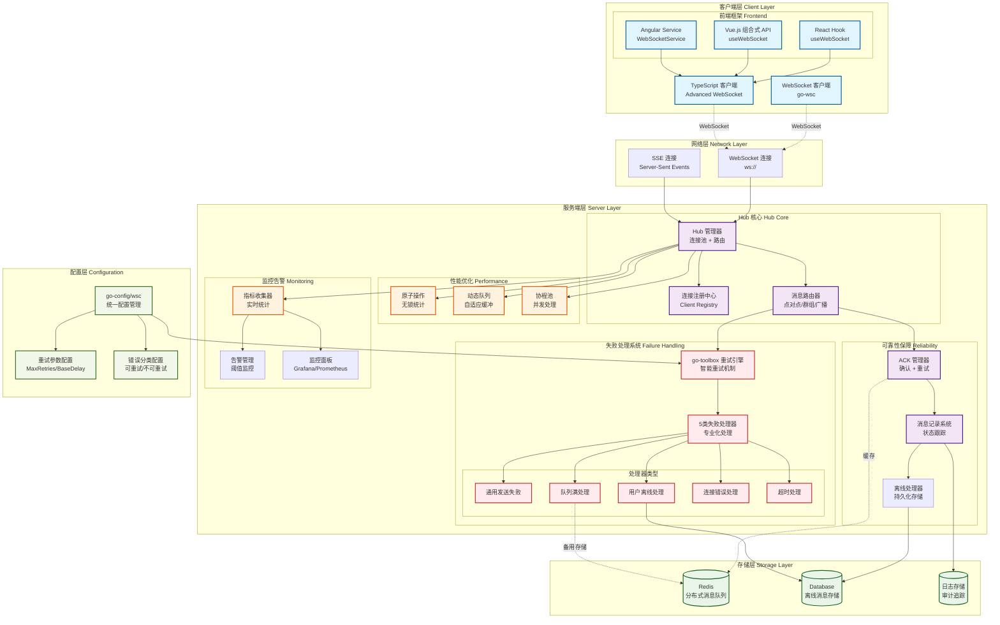

# Go WebSocket Client (go-wsc) 🚀

[](https://opensource.org/licenses/MIT)
[](https://github.com/kamalyes/go-wsc)
[](https://github.com/kamalyes/go-wsc/releases)
[](https://goreportcard.com/report/github.com/kamalyes/go-wsc)
[](https://pkg.go.dev/github.com/kamalyes/go-wsc?tab=doc)
[](https://github.com/kamalyes/go-wsc/issues)
[](https://github.com/kamalyes/go-wsc/stargazers)
[](https://codecov.io/gh/kamalyes/go-wsc)

**go-wsc** 是一个企业级 Go WebSocket 框架，专注于高性能实时通信。提供智能重连、消息确认(ACK)、连接池管理等关键特性，支持百万级并发连接。

## 🏗️ 系统架构



### 架构特点

- **分层设计**: 客户端层 → 网络层 → 服务端层 → 配置层 → 存储层
- **高可靠性**: ACK 确认机制 + 消息记录 + 离线处理 + 智能重试
- **失败处理**: 5类专业化失败处理器 + go-toolbox重试引擎
- **配置统一**: go-config/wsc 统一管理重试参数和错误分类
- **高性能**: 原子操作 + 动态队列 + 协程池优化  
- **可观测**: 全链路监控 + 实时告警 + 可视化面板
- **可扩展**: 分布式架构 + 水平扩展支持

## ✨ 核心特性

### 🎯 客户端能力

- **智能重连**：指数退避 + 抖动算法
- **消息类型**：文本/二进制/Ping/Pong
- **状态管理**：连接生命周期跟踪
- **缓冲机制**：可配置消息队列

### 🏢 服务端能力  

- **高并发**：百万级连接支持
- **消息路由**：点对点/群组/广播
- **ACK 确认**：可靠消息传输
- **性能监控**：实时指标统计

### 🔄 失败处理与重试

- **智能重试**：基于 go-toolbox 的重试引擎，支持指数退避
- **失败分类**：5类专业化失败处理器（通用/队列满/离线/连接错误/超时）
- **配置驱动**：通过 go-config/wsc 统一管理重试参数
- **详细记录**：完整的重试尝试历史和性能指标

### 📊 配置管理

- **统一配置**：go-config/wsc 包统一管理所有 WebSocket 相关配置
- **重试参数**：MaxRetries、BaseDelay、BackoffFactor 灵活配置
- **错误分类**：RetryableErrors 和 NonRetryableErrors 智能分类
- **热更新**：支持运行时配置更新和生效

## 📚 文档导航

### 📖 核心文档

- [🚀 快速开始](#-快速开始) - 5分钟上手指南
- [📦 安装配置](#-安装) - 依赖和环境要求
- [⚡ 性能表现](#-性能表现) - 基准测试结果

### 🔧 集成指南  

- [🎯 TypeScript 前端集成](./docs/TypeScript_Integration.md) - React/Vue/Angular 示例
- [☕ Java 客户端集成](./docs/Java_Client_Integration.md) - 企业级 Java 客户端实现
- [📡 ACK 消息确认机制](./docs/ACK_Mechanism.md) - 可靠消息传输
- [🔄 失败处理与重试机制](./docs/Failure_Handling.md) - 全面的失败处理策略
- [🏗️ 架构设计文档](./docs/Architecture_Design.md) - 回调与失败机制架构
- [📊 性能优化指南](./docs/Performance_Guide.md) - 调优和监控

### 📋 API 参考

- [🔌 客户端 API](./docs/Client_API.md) - 完整接口说明  
- [🏢 服务端 Hub API](./docs/Hub_API.md) - Hub 管理接口与失败处理器
- [🧪 测试覆盖报告](./docs/Test_Coverage.md) - 测试用例和覆盖率

## 📦 安装

```bash
go get github.com/kamalyes/go-wsc
```

**系统要求：** Go 1.20+ | 支持 Linux/Windows/macOS

## 🚀 快速开始

### 基础客户端 (5分钟上手)

```go
package main

import (
    "fmt"
    "github.com/kamalyes/go-wsc"
)

func main() {
    // 1. 创建客户端
    client := wsc.New("ws://localhost:8080/ws")
    
    // 2. 设置消息处理
    client.OnTextMessageReceived(func(message string) {
        fmt.Printf("📨 收到: %s\n", message)
    })
    
    // 3. 连接并发送消息
    client.Connect()
    client.SendText("Hello WebSocket!")
    
    select {} // 保持运行
}
```

### 基础服务端（含失败处理）

```go
package main

import (
    "context"
    "log"
    "net/http"
    "time"
    
    "github.com/kamalyes/go-wsc"
)

func main() {
    hub := wsc.NewHub()
    
    // 配置失败处理器
    setupFailureHandlers(hub)
    
    go hub.Run()
    
    http.HandleFunc("/ws", func(w http.ResponseWriter, r *http.Request) {
        wsc.HandleWebSocket(hub, w, r)
    })
    
    http.ListenAndServe(":8080", nil)
}

// 配置失败处理器
func setupFailureHandlers(hub *wsc.Hub) {
    // 通用失败处理器
    hub.AddSendFailureHandler(&MyFailureHandler{})
    
    // 用户离线处理器
    hub.AddUserOfflineHandler(&MyOfflineHandler{})
    
    // 队列满处理器  
    hub.AddQueueFullHandler(&MyQueueHandler{})
}

// 自定义失败处理器
type MyFailureHandler struct{}

func (h *MyFailureHandler) HandleSendFailure(msg *wsc.HubMessage, recipient string, reason string, err error) {
    log.Printf("🚨 消息发送失败: 用户=%s, 原因=%s, 消息=%s", recipient, reason, msg.ID)
}

type MyOfflineHandler struct{}

func (h *MyOfflineHandler) HandleUserOffline(msg *wsc.HubMessage, userID string, err error) {
    log.Printf("👤 用户离线，存储消息: 用户=%s, 消息=%s", userID, msg.ID)
    // 存储离线消息到数据库
}

type MyQueueHandler struct{}

func (h *MyQueueHandler) HandleQueueFull(msg *wsc.HubMessage, recipient string, queueType string, err error) {
    log.Printf("📦 队列满，备用存储: 队列=%s, 用户=%s", queueType, recipient)
    // 存储到Redis等外部存储
}
```

### 带重试机制的消息发送

```go
// 使用重试机制发送重要消息
func sendImportantMessage(hub *wsc.Hub, userID string, content string) {
    msg := &wsc.HubMessage{
        ID:       generateMessageID(),
        Type:     wsc.TextMessage,
        Content:  content,
        CreateAt: time.Now(),
        Priority: wsc.HighPriority,
    }
    
    // 带详细重试信息的发送
    result := hub.SendToUserWithRetry(context.Background(), userID, msg)
    
    if result.Success {
        log.Printf("✅ 消息发送成功，重试 %d 次，总耗时 %v", result.TotalRetries, result.TotalTime)
    } else {
        log.Printf("❌ 消息发送失败，重试 %d 次后放弃: %v", result.TotalRetries, result.FinalError)
    }
    
    // 查看详细的重试历史
    for i, attempt := range result.Attempts {
        log.Printf("   尝试 %d: %v (%v)", i+1, attempt.Success, attempt.Duration)
    }
}
```

> 💡 **深入学习**: 查看 [TypeScript 集成文档](./docs/TypeScript_Integration.md) 了解前端集成示例

## ⚡ 性能表现

### 基准测试结果

- **吞吐量**: 720万条消息/秒
- **客户端注册**: ~2,430 ns/op  
- **消息发送**: ~138 ns/op
- **并发连接**: 百万级支持

### 关键优化

- **原子操作**: 无锁统计和状态管理
- **动态队列**: 自适应缓冲区大小调整
- **协程池**: 高效的并发消息处理
- **内存池**: 减少 GC 压力的对象重用

> 📊 **详细分析**: 查看 [性能优化指南](./docs/Performance_Guide.md) 获取调优建议

## 🔧 高级配置

### 客户端配置示例

```go
config := wsc.Config{
    WriteWait:          15 * time.Second,
    PongWait:           60 * time.Second, 
    PingPeriod:         54 * time.Second,
    MaxMessageSize:     1024,
    MessageBufferSize:  512,
    AutoReconnect:      true,
    MinRecTime:         1 * time.Second,
    MaxRecTime:         30 * time.Second,
    RecFactor:          2.0,
}

client := wsc.New("ws://localhost:8080/ws")
client.SetConfig(config)
```

### 重试机制配置

```go
// go-config/wsc 配置文件示例
import (
    wscconfig "github.com/kamalyes/go-config/pkg/wsc"
)

// YAML 配置文件 config.yaml
/*
wsc:
  max_retries: 5
  base_delay: 200ms
  backoff_factor: 1.5
  retryable_errors:
    - "queue_full"
    - "timeout"
    - "conn_error"
    - "channel_closed"
    - "network_unreachable"
  non_retryable_errors:
    - "user_offline"
    - "permission"
    - "validation"
    - "authentication_failed"
*/

// 代码中使用配置
hub := wsc.NewHub()
// 配置会自动从 go-config/wsc 加载
```

### 失败处理器配置

```go
// 配置多个失败处理器
hub := wsc.NewHub()

// 添加日志记录处理器
hub.AddSendFailureHandler(&LoggingFailureHandler{
    logLevel: "ERROR",
})

// 添加指标收集处理器
hub.AddSendFailureHandler(&MetricsFailureHandler{
    prometheusRegistry: registry,
})

// 添加告警处理器
hub.AddSendFailureHandler(&AlertFailureHandler{
    alertThreshold: 10,
    alertChannel:   "#operations",
})

// 专门的队列满处理器，使用Redis作为备用存储
hub.AddQueueFullHandler(&RedisQueueHandler{
    redisClient: redisClient,
    keyPrefix:   "wsc:queue:",
    ttl:         24 * time.Hour,
})

// 专门的离线用户处理器，使用数据库存储
hub.AddUserOfflineHandler(&DatabaseOfflineHandler{
    db:             database,
    tableName:      "offline_messages",
    maxOfflineMsg:  1000,
})
```

### ACK 消息确认

```go
// 发送需要确认的消息
ackMessage := wsc.CreateAckMessage("message-123", "Hello World")
client.SendAckMessage(ackMessage)

// 处理 ACK 确认
client.OnAckReceived(func(messageID string) {
    fmt.Printf("✅ 消息 %s 已确认\n", messageID)
})
```

> 🔗 **深入了解**: 查看 [ACK 消息确认机制](./docs/ACK_Mechanism.md) 了解可靠消息传输

## 🧪 测试与质量

### 测试覆盖

- **测试用例**: 368个
- **通过率**: 100%
- **覆盖范围**: 单元测试 + 集成测试 + 竞态检测
- **基准测试**: 性能回归保护

### 持续集成

```bash
# 运行所有测试
go test ./... -v

# 运行基准测试
go test -bench=. -benchmem

# 竞态检测
go test -race ./...

# 生成覆盖报告
go test -coverprofile=coverage.out ./...
go tool cover -html=coverage.out
```

> 📋 **测试报告**: 查看 [测试覆盖报告](./docs/Test_Coverage.md) 了解详细测试情况

## 💼 企业特性

### 生产环境支持

- **监控集成**: Prometheus/Grafana 指标导出
- **日志标准**: 结构化日志 (JSON) 输出
- **优雅关闭**: 平滑连接迁移和资源清理
- **健康检查**: HTTP 端点支持负载均衡器探测

### 分布式架构

- **节点发现**: 自动服务发现和负载均衡
- **消息路由**: 跨节点消息传递和状态同步  
- **故障转移**: 自动故障检测和流量切换
- **水平扩展**: 无状态设计支持弹性伸缩

## 🤝 社区与支持

### 获取帮助

- **问题报告**: [GitHub Issues](https://github.com/kamalyes/go-wsc/issues)
- **功能请求**: [GitHub Discussions](https://github.com/kamalyes/go-wsc/discussions)
- **安全问题**: [security@example.com](mailto:security@example.com)

### 贡献指南

1. Fork 项目并创建特性分支
2. 添加测试用例确保代码质量
3. 更新文档说明变更内容
4. 提交 Pull Request 等待代码审查

## 📄 许可证

本项目采用 [MIT 许可证](LICENSE) 开源。

---

**⭐ 如果这个项目对你有帮助，请给个 Star 支持一下！**
