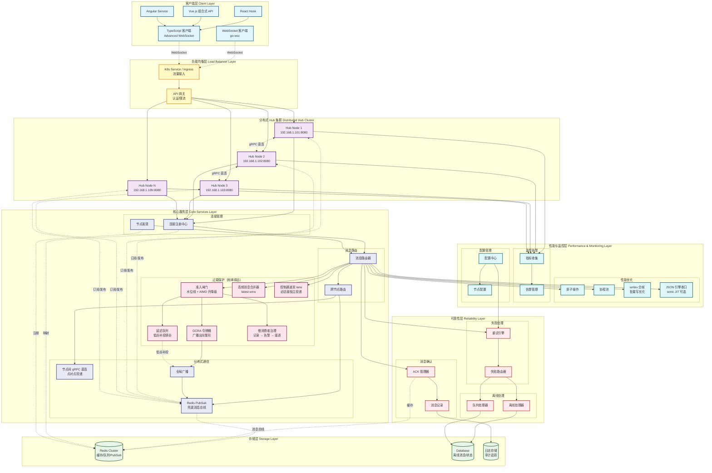

# Go WebSocket Client (go-wsc) 🚀

[](https://opensource.org/licenses/MIT)
[](https://github.com/kamalyes/go-wsc)
[](https://github.com/kamalyes/go-wsc/releases)
[](https://goreportcard.com/report/github.com/kamalyes/go-wsc)
[](https://pkg.go.dev/github.com/kamalyes/go-wsc?tab=doc)
[](https://github.com/kamalyes/go-wsc/issues)
[](https://github.com/kamalyes/go-wsc/stargazers)
[](https://codecov.io/gh/kamalyes/go-wsc)

**go-wsc** 是一个企业级 Go WebSocket 框架，专注于高性能实时通信。提供智能重连、消息确认(ACK)、连接池管理等关键特性，内置削峰填谷与消息分级送达（必达/普通/高频三级语义）、慢消费者治理、writev 合帧批量写，内置 gRPC 集群直连与四层跨节点自愈容错，支持百万级并发连接。

## 🏗️ 系统架构


```mermaid
graph TB
    subgraph "客户端层 Client Layer"
        direction LR
        WSC[WebSocket 客户端<br/>go-wsc]
        TSC[TypeScript 客户端<br/>Advanced WebSocket]
        React[React Hook]
        Vue[Vue.js 组合式 API]
        Angular[Angular Service]
    end

    subgraph "负载均衡层 Load Balancer Layer"
        direction LR
        LB[K8s Service / Ingress<br/>流量接入]
        Gateway[API 网关<br/>认证/限流]
    end

    subgraph "分布式 Hub 集群 Distributed Hub Cluster"
        direction LR
        Hub1[Hub Node 1<br/>192.168.1.101:8080]
        Hub2[Hub Node 2<br/>192.168.1.102:8080]
        Hub3[Hub Node 3<br/>192.168.1.103:8080]
        HubN[Hub Node N<br/>192.168.1.10N:8080]
    end

    subgraph "核心服务层 Core Services Layer"
        direction LR

        subgraph "连接管理"
            ConnRegistry[连接注册中心]
            NodeDiscovery[节点发现]
        end

        subgraph "消息路由"
            MsgRouter[消息路由器]
            CrossNodeRouter[跨节点路由]
        end

        subgraph "过载保护（削峰填谷）"
            AdmissionGate[准入闸门<br/>水位线 + AIMD 升降级]
            TokenBucket[GCRA 令牌桶<br/>广播出向整形]
            Coalescer[高频消息合并器<br/>latest-wins]
            DelayQueue[延迟队列<br/>低谷补投填谷]
            SlowGov[慢消费者治理<br/>记录 → 告警 → 驱逐]
            CtrlLane[控制通道双 lane<br/>必达级独立投递]
        end

        subgraph "分布式通信"
            GRPCDirect[节点间 gRPC 直连<br/>点对点投递]
            PubSub[Redis PubSub<br/>兜底消息总线]
            BroadcastMgr[全局广播]
        end
    end

    subgraph "可靠性层 Reliability Layer"
        direction LR

        subgraph "消息确认"
            ACKMgr[ACK 管理器]
            MsgRecord[消息记录]
        end

        subgraph "失败处理"
            RetryEngine[重试引擎]
            FailureRouter[失败路由器]
        end

        subgraph "离线处理"
            OfflineHandler[离线处理器]
            QueueHandler[队列处理器]
        end
    end

    subgraph "性能与监控层 Performance & Monitoring Layer"
        direction LR

        subgraph "性能优化"
            AtomicOps[原子操作]
            WorkerPool[协程池]
            FrameBatcher[writev 合帧<br/>批量写优化]
            JsonEngine[JSON 引擎收口<br/>sonic JIT 可选]
        end

        subgraph "监控告警"
            MetricsCol[指标收集]
            AlertMgr[告警管理]
        end

        subgraph "配置管理"
            ConfigMgr[配置中心]
            NodeConfig[节点配置]
        end
    end

    subgraph "存储层 Storage Layer"
        direction LR
        RedisCluster[(Redis Cluster<br/>缓存/队列/PubSub)]
        Database[(Database<br/>离线消息/状态)]
        LogStore[(日志存储<br/>审计追踪)]
    end

    %% 客户端到负载均衡
    WSC -.->|WebSocket| LB
    TSC -.->|WebSocket| LB
    React --> TSC
    Vue --> TSC
    Angular --> TSC

    %% 负载均衡到 Hub 集群
    LB --> Gateway
    Gateway --> Hub1
    Gateway --> Hub2
    Gateway --> Hub3
    Gateway --> HubN

    %% Hub 到核心服务
    Hub1 --> ConnRegistry
    Hub2 --> ConnRegistry
    Hub3 --> ConnRegistry
    HubN --> ConnRegistry

    ConnRegistry --> MsgRouter
    NodeDiscovery --> MsgRouter
    MsgRouter --> CrossNodeRouter

    %% 过载保护（削峰填谷）
    MsgRouter --> AdmissionGate
    AdmissionGate --> TokenBucket
    TokenBucket --> BroadcastMgr
    AdmissionGate --> DelayQueue
    DelayQueue -.->|低谷补投| BroadcastMgr
    AdmissionGate --> SlowGov
    MsgRouter --> Coalescer
    MsgRouter --> CtrlLane

    %% 分布式通信
    CrossNodeRouter --> GRPCDirect
    CrossNodeRouter --> PubSub
    BroadcastMgr --> PubSub
    Hub1 <-.->|gRPC 直连| Hub2
    Hub2 <-.->|gRPC 直连| Hub3
    Hub1 <-.->|订阅/发布| PubSub
    Hub2 <-.->|订阅/发布| PubSub
    Hub3 <-.->|订阅/发布| PubSub
    HubN <-.->|订阅/发布| PubSub

    %% 可靠性流程
    MsgRouter --> ACKMgr
    ACKMgr --> MsgRecord
    MsgRouter --> RetryEngine
    RetryEngine --> FailureRouter
    FailureRouter --> OfflineHandler
    FailureRouter --> QueueHandler

    %% 性能与监控
    MsgRouter --> AtomicOps
    MsgRouter --> WorkerPool
    MsgRouter --> FrameBatcher
    MsgRouter --> JsonEngine
    Hub1 --> MetricsCol
    Hub2 --> MetricsCol
    Hub3 --> MetricsCol
    HubN --> MetricsCol
    MetricsCol --> AlertMgr
    ConfigMgr --> RetryEngine
    ConfigMgr --> NodeConfig

    %% 存储连接
    PubSub -.->|消息总线| RedisCluster
    ACKMgr -.->|缓存| RedisCluster
    ConnRegistry -.->|映射| RedisCluster
    NodeDiscovery -.->|注册| RedisCluster
    OfflineHandler --> Database
    QueueHandler --> Database
    MsgRecord --> LogStore

    %% 样式定义
    classDef clientStyle fill:#e1f5fe,stroke:#01579b,stroke-width:2px
    classDef lbStyle fill:#fff9c4,stroke:#f57f17,stroke-width:2px
    classDef hubStyle fill:#f3e5f5,stroke:#4a148c,stroke-width:2px
    classDef coreStyle fill:#e8eaf6,stroke:#283593,stroke-width:2px
    classDef reliabilityStyle fill:#ffebee,stroke:#c62828,stroke-width:2px
    classDef perfStyle fill:#e0f7fa,stroke:#006064,stroke-width:2px
    classDef overloadStyle fill:#fce4ec,stroke:#880e4f,stroke-width:2px
    classDef storageStyle fill:#e8f5e8,stroke:#1b5e20,stroke-width:2px

    class WSC,TSC,React,Vue,Angular clientStyle
    class LB,Gateway lbStyle
    class Hub1,Hub2,Hub3,HubN hubStyle
    class ConnRegistry,NodeDiscovery,MsgRouter,CrossNodeRouter,GRPCDirect,PubSub,BroadcastMgr coreStyle
    class AdmissionGate,TokenBucket,Coalescer,DelayQueue,SlowGov,CtrlLane overloadStyle
    class ACKMgr,MsgRecord,RetryEngine,FailureRouter,OfflineHandler,QueueHandler reliabilityStyle
    class AtomicOps,WorkerPool,FrameBatcher,JsonEngine,MetricsCol,AlertMgr,ConfigMgr,NodeConfig perfStyle
    class RedisCluster,Database,LogStore storageStyle
```

### 📦 模块分层

14 个域包 + 2 个适配器包：每域以 `interfaces.go` 定义消费者端口，hub 编排层实现各域 Host 端口做委托；适配器只实现 `spi` 契约，与核心独立演进。根包 `wsc.go` 提供门面（`type Hub = hub.Hub`）。

| 包 | 职责 |
| --- | --- |
| [hub](./hub/README.md) | 编排层：组装各域、实现消费者端口、生命周期与集群分发，对外唯一入口 |
| [client](./client/README.md) | 客户端 SDK：建连、认证、收发消息、心跳保活、断线自动重连（WS 优先、SSE 降级） |
| [connection](./connection/README.md) | 连接域：百万连接的注册/查找/容量/质量，64 分片注册表 |
| [transport](./transport/README.md) | 接入层：WS/SSE 升级握手、AES-256-GCM Token 解密、连接预检，标准 net/http 签名 |
| [messaging](./messaging/README.md) | 消息域：入站分发、路由收敛、P2P/广播投递、ACK、失败转离线 |
| [batcher](./batcher/README.md) | 批处理域：消息记录/状态/统计/观察者通知的攒批写，写放大治理 |
| [stats](./stats/README.md) | 统计域：bitmap 在线状态 O(1) 点查询 + 指标 + 健康上报 |
| [group](./group/README.md) | 群组域：三层订阅索引 + VIP 分级 + 观察者，定向广播收敛的数据源 |
| [overload](./overload/README.md) | 过载域：AIMD 准入闸门 + GCRA 整形 + 高频合并 + 慢消费者治理 |
| [cluster](./cluster/README.md) | 分布式域：节点发现、跨节点投递、自愈、防乒乓（多 Pod 对等组网，无选主） |
| [constants](./constants/README.md) | 常量域：协议常量与默认值的唯一定义源，零依赖 |
| [models](./models/README.md) | 数据层：全部域共享的数据结构，纯 struct 零依赖 |
| [routing](./routing/README.md) | 路由域：路由信封（appID/namespace/groupIDs）的构建与传播 |
| [spi](./spi/README.md) | 契约层：核心与后端之间的接口边界（Store/Sink/Queue 三分法） |
| [adapter/redis](./adapter/redis/README.md) | Redis 适配器：在线状态、集群统计、群组、客服负载、离线队列 |
| [adapter/gorm](./adapter/gorm/README.md) | GORM 适配器：连接记录、连接质量、消息归档、离线消息持久化 |

### 架构特点

- **领域分层**: 14 个域包 + 2 个适配器包（batcher、client、cluster、connection、constants、group、messaging、models、overload、routing、spi、stats、transport、hub 编排层），每域以 `interfaces.go` 定义消费者端口，hub 编排层实现各域 Host 端口做委托
- **分布式集群**: 多节点 Hub 集群 + gRPC 直连 + Redis PubSub 兜底 + 自动节点发现
- **K8s Deployment 部署**: 多副本对等组网，滚动更新靠优雅停机排空 + 跨节点自愈 + 离线回放，消息不丢
- **跨节点通信**:
  - 同节点通信: 内存直达，延迟 < 1ms
  - 跨节点通信: gRPC 点对点直连（低延迟、强类型、并行投递）
  - PubSub 兜底: gRPC 未启用/失败时降级 Redis PubSub，Pipeline 批量定向发布
  - 全局广播: 自动同步到所有节点
- **高可靠性**: ACK 确认机制 + 消息记录 + 离线处理 + 智能重试
- **削峰填谷**: 准入闸门（水位线 + AIMD 升降级）+ GCRA 令牌桶广播整形 + 延迟队列低谷补投
- **消息分级送达**: 必达/普通/高频三级语义，洪峰下分级保护（必达走控制通道，高频 latest-wins 合并）
- **慢消费者治理**: 三段式渐进处置（记录 → 告警 → 驱逐），驱逐前排空积压移交 ACK 链路兜底
- **高性能写路径**: writev 合帧批量写（突发 N 条 → 2 次 syscall）+ JSON 引擎收口（构建标签启用 sonic JIT，大消息场景数倍提速）
- **跨节点自愈**: 死节点秒级感知 + user_not_found 重路由 + 死索引清理 + 幽灵连接回收
- **全链路追踪**: trace_id 贯穿 gRPC/PubSub/离线推送全链路
- **多租户隔离**: appID + namespace 应用级消息隔离
- **失败处理**: 5类专业化失败处理器 + go-toolbox重试引擎
- **配置统一**: go-config/wsc 统一管理重试参数、错误分类和节点配置
- **高性能**: 原子操作 + 动态队列 + 协程池优化
- **可观测**: 全链路监控 + 实时告警 + 可视化面板
- **水平扩展**: 无状态设计 + 弹性伸缩 + 节点自动注册/心跳
- **高可用**: 节点故障自动恢复 + 客户端自动重连 + 会话保持

## ✨ 核心特性

### 🎯 客户端能力

- **智能重连**：指数退避 + 抖动算法
- **消息类型**：文本/二进制/Ping/Pong等103种
- **状态管理**：连接生命周期跟踪
- **缓冲机制**：可配置消息队列

### 🏢 服务端能力

- **高并发**：百万级连接支持
- **消息路由**：点对点/群组/广播
- **集群投递**：gRPC 直连优先 + PubSub 兜底 + 死节点秒级感知
- **削峰填谷**：准入闸门 + 令牌桶整形 + 延迟队列填谷，洪峰不丢必达消息
- **消息分级**：必达/普通/高频三级送达语义，差异化路由与兜底
- **慢消费者治理**：背压保护 + 三段式渐进处置，防止单连接拖垮全局
- **ACK 确认**：可靠消息传输 + 跨节点 ACK 超时兜底
- **全链路追踪**：trace_id 贯穿发送/投递/ACK/离线全链路
- **多租户隔离**：appID + namespace 应用级消息隔离
- **性能监控**：实时指标统计

### 🛡️ 跨节点可靠性与自愈

消息投递的四层容错链（逐层兜底，覆盖不同故障形态）：

| 层级 | 机制 | 覆盖场景 | 响应时延 |
| --- | --- | --- | --- |
| ① 死节点感知 | `PUBLISH` 返回值检测频道订阅数，全失活立即转离线 | Pod 挂掉/订阅断连，消息从未送达 | 秒级 |
| ② user_not_found 重路由 | 目标节点回告用户不在，重查索引定向补投/转离线 | 节点活着但用户已迁移（索引过期） | 秒级 |
| ③ ACK 超时兜底 | 跨节点 ACK 时间轮扫描，超时标记并转存离线 | 投递中节点挂掉/消息丢失 | 30s |
| ④ 幽灵连接回收 | 新节点注册时检测 clientID 漂移，通知旧节点踢掉半开连接 | 断线重连跨节点漂移 | 秒级 |

配套机制：

- **死索引自愈**：目标节点扑空时异步清理指向本节点的死索引条目
- **owner 归属校验**：Lua 脚本保证索引清理不误删其他节点已接管的条目
- **节点重注册**：周期性完整重注册（含 gRPC 地址），Redis key 被删/TTL 过期后自动恢复上报

### 🌊 削峰填谷与消息分级送达

消息洪峰下的过载保护体系——分级裁决 + 削峰整形 + 填谷补投，拒绝不等于丢弃：

| 级别 | 语义 | 路由路径 | 洪峰行为 | 兜底链路 |
| --- | --- | --- | --- | --- |
| 必达 Guaranteed | 不可丢失（支付/踢出/强制下线） | 控制通道双 lane（独立缓冲） | 恒放行，不受水位裁决 | ACK 重试 + 离线存储双保险 |
| 普通 Standard | 尽力送达（聊天/通知） | 数据 lane | 极端水位转离线补发 | 离线上线推送 + ACK 超时兜底 |
| 高频 Ephemeral | 最新值即全量（输入状态/行情） | 合并器（latest-wins） | 同 key 只保最新，覆盖即削峰 | 容量满语义丢弃（新值即真相） |

配套组件（轻量组装：零值即关闭，热路径 nil 检查零开销）：

- **准入闸门**：在途积压量水位（written - delivered）+ AIMD 升降级（L0 正常→L1 告警→L2 延迟→L3 仅关键→L4 只读），升级快降级慢防抖动，三态裁决（放行/延迟/离线）
- **GCRA 令牌桶**：广播出向整形，平滑突发速率，防止广播风暴击穿出口带宽
- **延迟队列**：高水位时广播消息入队缓写，低谷周期 drain 补投（填谷）
- **高频合并器**：同用户同类型只保最新值（latest-wins），50ms 周期批量投递
- **慢消费者治理**：三段式渐进处置（记录 → 告警 → 驱逐），驱逐前排空积压移交 ACK 链路兜底，防止单连接拖垮全局
- **运行期热替换**：`SetOverloadPolicy` 基于 atomic.Pointer 安全发布，组件可运行期替换不停服

启用示例：

```go
h := wsc.NewHub(cfg)

// 削峰填谷三件套：准入闸门 + 广播整形 + 高频合并（均轻量组装，按需传 nil 跳过）
h.SetOverloadPolicy(
    overload.NewAdmissionGate(10_000, 3_000, time.Second), // 高/低水位 + 评估周期
    overload.NewShaper(50_000),                             // 广播出向 5w msg/s
    overload.NewCoalescer(8_192),                           // 高频合并容量
)

// 送达漏斗指标（overload.OverloadMetrics）全 atomic 零锁计数：
// admitted → realtime / offline / merged / dropped，守恒不变量由测试断言
```

> 消息分级通过 `HubMessage` 的 `Guarantee` 字段声明（`models.GuaranteeGuaranteed` / `GuaranteeStandard` / `GuaranteeEphemeral`），未声明时按决策树推导：消息类型默认表 → 分类评分 → 关键优先级 → 兜底普通档。

### 🔄 失败处理与重试

- **智能重试**：基于 go-toolbox 的重试引擎，支持指数退避
- **失败分类**：5类专业化失败处理器（通用/队列满/离线/连接错误/超时）
- **配置驱动**：通过 go-config/wsc 统一管理重试参数
- **详细记录**：完整的重试尝试历史和性能指标

### 📊 配置管理

- **统一配置**：go-config/wsc 包统一管理所有 WebSocket 相关配置
- **重试参数**：MaxRetries、BaseDelay、BackoffFactor 灵活配置
- **错误分类**：RetryableErrors 和 NonRetryableErrors 智能分类
- **热更新**：支持运行时配置更新和生效

## 📚 文档导航

### 📖 核心文档

- [📦 安装配置](#-安装) - 依赖和环境要求
- [🚀 快速开始](#-快速开始) - 5分钟上手指南
- [⚡ 性能表现](#-性能表现) - 基准测试结果

## 📦 安装

```bash
go get github.com/kamalyes/go-wsc
```

**系统要求：** Go 1.25+ | 支持 Linux/Windows/macOS

## 🚀 快速开始

### 最小服务端

Hub 以库形态嵌入业务进程；`transport` 提供标准 `net/http` 签名的接入层，可嵌任何路由：

```go
package main

import (
	"net/http"

	wscconfig "github.com/kamalyes/go-config/pkg/wsc"
	"github.com/kamalyes/go-wsc"
	"github.com/kamalyes/go-wsc/transport"
)

func main() {
	cfg := &wscconfig.WSC{
		NodeIP:   "192.168.1.101",
		NodePort: 8080,
		Path:     "/ws",
	}

	h := wsc.NewHub(cfg)

	// WS 接入（Hub 实现了 transport.Registrar 端口：注册/注销/关闭态）
	mux := http.NewServeMux()
	upgrader := transport.NewUpgrader(cfg, h)
	mux.HandleFunc(cfg.Path, upgrader.HandleWebSocketUpgrade)

	go h.Run() // 事件循环：心跳检查 / ACK 清理 / 统计刷写（阻塞直至关闭）

	http.ListenAndServe(":8080", mux)
}
```

### 注入仓储与离线链路（生产形态）

```go
rdb := redis.NewClient(&redis.Options{Addr: "localhost:6379"})
db, err := gorm.Open(mysql.Open("user:pass@tcp(localhost:3306)/wsc"), &gorm.Config{})
if err != nil {
	panic(err)
}

// 一行装配全部存储仓储：在线状态/集群统计/群组 + 连接记录/连接质量/消息归档
err = spi.Initialize(ctx, h, rdb, db,
	redisadapter.NewHooks(cfg.RedisRepository),
	gormadapter.NewHooks(cfg.Database),
)

// 离线链路：Redis 队列 + RDBMS 双写，用户首连自动回放（Deployment 共享存储语义，跨 Pod 可见）
offlineCfg := &wscconfig.OfflineMessage{AutoPush: true}
err = messaging.InitializeOfflineQueue(h, messaging.OfflineDeps{
	Queue:  redisadapter.NewOfflineQueue(rdb, offlineCfg.KeyPrefix, offlineCfg.QueueTTL),
	Store:  gormadapter.NewOfflineStoreFor(db, offlineCfg),
	Config: offlineCfg,
})
```

> 适配器目录名与包名不同（避免与 go-redis / gorm 冲突）：`redisadapter "github.com/kamalyes/go-wsc/adapter/redis"`、`gormadapter "github.com/kamalyes/go-wsc/adapter/gorm"`。

## ⚡ 性能表现

- **吞吐量**: 720万条消息/秒
- **客户端注册**: ~2,430 ns/op
- **消息发送**: ~138 ns/op
- **序列化引擎**: sonic JIT（`-tags sonic`）大消息场景 ~4x 提速，默认标准库零依赖
- **批量写**: writev 合帧，突发 N 条消息从 N 次 syscall 降为 2 次
- **并发连接**: 百万级支持

## 💼 企业特性

### 生产环境支持

- **监控集成**: Prometheus/Grafana 指标导出
- **日志标准**: 结构化日志 (JSON) 输出
- **优雅关闭**: 平滑连接迁移和资源清理
- **健康检查**: HTTP 端点支持负载均衡器探测

### 分布式架构

- **零侵入部署**: 库形态嵌入业务进程，标准 `net/http` 签名接入；多副本 Deployment 即集群，自动服务注册与发现
- **节点发现**: 自动服务注册、心跳检测、周期性重注册（Redis key 删除/TTL 过期自动恢复上报）
- **智能路由**:
  - 同节点通信: 内存直达，延迟 < 1ms
  - 跨节点通信: gRPC 点对点直连优先（并行投递，单死节点不拖累整批），PubSub Pipeline 定向发布兜底
  - 自动路由到用户所在节点
- **全局广播**: 自动同步到所有节点的所有客户端
- **多租户隔离**: appID + namespace 应用级消息隔离，跨应用消息互不可见
- **Deployment 语义**: 优雅停机排空连接 + 跨节点自愈接管 + 离线消息回放，滚动更新消息不丢
- **故障转移**: 死节点秒级感知（PUBLISH 订阅数检测）+ user_not_found 秒级重路由 + 客户端自动重连
- **跨节点自愈**: 死索引清理 + 幽灵连接回收 + owner 归属校验（防误删）
- **水平扩展**: 无状态设计支持弹性伸缩，线性扩展并发能力
- **高可用**: 多节点冗余 + 自动故障恢复 + 负载均衡

## 🤝 社区与支持

### 获取帮助

- **问题报告**: [GitHub Issues](https://github.com/kamalyes/go-wsc/issues)
- **功能请求**: [GitHub Discussions](https://github.com/kamalyes/go-wsc/discussions)

### 贡献指南

1. Fork 项目并创建特性分支
2. 添加测试用例确保代码质量
3. 更新文档说明变更内容
4. 提交 Pull Request 等待代码审查

## 📄 许可证

本项目采用 [MIT 许可证](LICENSE) 开源。

## 📌 Commit Emoji 图例

在本项目的提交记录中，我们使用以下 emoji 标记不同类型的变更：

| Emoji | 类型     | 说明                 |
| ----- | -------- | -------------------- |
| 🔥    | feat     | 新增功能或重大重构   |
| 🐛    | fix      | Bug 修复             |
| ➕    | add      | 添加新模块/文件      |
| 📊    | data     | 连接记录、数据持久化 |
| 📈    | stats    | 统计信息、监控指标   |
| 📮    | queue    | 消息队列相关         |
| 💾    | database | 数据库、GORM 相关    |
| 📦    | storage  | 离线消息、存储层     |
| 🟢    | status   | 在线状态管理         |
| ⚖️    | balance  | 负载管理、负载均衡   |
| 🗑️    | remove   | 移除文件、清理代码   |
| ✅    | test     | 修复测试、测试相关   |
| ⚡    | perf     | 性能优化             |
| 📝    | docs     | 文档更新             |
| 🎨    | style    | 代码格式、样式调整   |
| ♻️    | refactor | 代码重构             |
| 🔒    | security | 安全相关             |
| 🚀    | deploy   | 部署、发布相关       |

---

**⭐ 如果这个项目对你有帮助，请给个 Star 支持一下！**
