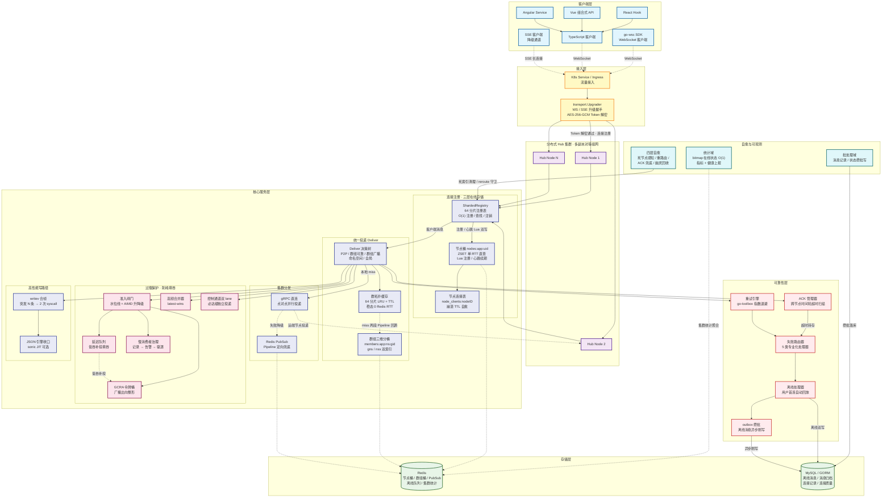

# Go WebSocket Client (go-wsc) 🚀

[](https://opensource.org/licenses/MIT)
[](https://github.com/kamalyes/go-wsc)
[](https://github.com/kamalyes/go-wsc/releases)
[](https://goreportcard.com/report/github.com/kamalyes/go-wsc)
[](https://pkg.go.dev/github.com/kamalyes/go-wsc?tab=doc)
[](https://github.com/kamalyes/go-wsc/issues)
[](https://github.com/kamalyes/go-wsc/stargazers)
[](https://codecov.io/gh/kamalyes/go-wsc)

**go-wsc** 是一个企业级 Go WebSocket/SSE 实时通信框架，面向百万级并发连接设计。核心能力：`Hub.Deliver` 统一投递入口（P2P / 群组 / 广播决策树）、appID+namespace 多租户隔离、群组拓扑常驻内存缓存（稳态群消息扇出 0 Redis RTT）、gRPC 集群直连 + PubSub 兜底 + 四层跨节点自愈、削峰填谷与消息分级送达（必达/普通/高频）、慢消费者治理、writev 合帧批量写。

## 🏗️ 系统架构


```mermaid
graph TB
    %% ==================== 客户端层 ====================
    subgraph "客户端层"
        WSC["go-wsc SDK<br/>WebSocket 客户端"]
        TSC["TypeScript 客户端"]
        React["React Hook"]
        Vue["Vue 组合式 API"]
        Angular["Angular Service"]
        SSEClient["SSE 客户端<br/>降级通道"]
    end

    %% ==================== 接入层 ====================
    subgraph "接入层"
        LB["K8s Service / Ingress<br/>流量接入"]
        Upgrader["transport.Upgrader<br/>WS / SSE 升级握手<br/>AES-256-GCM Token 解密"]
    end

    %% ==================== 分布式 Hub 集群 ====================
    subgraph "分布式 Hub 集群 · 多副本对等组网"
        Hub1["Hub Node 1"]
        Hub2["Hub Node 2"]
        HubN["Hub Node N"]
    end

    %% ==================== 核心服务层 ====================
    subgraph "核心服务层"

        subgraph "连接注册 · 三层在线存储"
            Registry["ShardedRegistry<br/>64 分片注册表<br/>O(1) 注册 / 查找 / 注销"]
            OnlineStore["节点桶 nodes:app:uid<br/>ZSET 单 RTT 直查<br/>Lua 注册 / 心跳续期"]
            NodeClients["节点连接表<br/>node_clients:nodeID<br/>崩溃 TTL 自愈"]
        end

        subgraph "统一投递 Deliver"
            Deliver["Deliver 决策树<br/>P2P / 群组可靠 / 群组广播<br/>命名空间 / 全局"]
            TopoCache["群拓扑缓存<br/>64 分片 LRU + TTL<br/>稳态 0 Redis RTT"]
            GroupStore["群组三维分桶<br/>members:app:ns:gid<br/>gns / nss 双索引"]
        end

        subgraph "过载保护 · 削峰填谷"
            AdmissionGate["准入闸门<br/>水位线 + AIMD 升降级"]
            TokenBucket["GCRA 令牌桶<br/>广播出向整形"]
            Coalescer["高频合并器<br/>latest-wins"]
            DelayQueue["延迟队列<br/>低谷补投填谷"]
            SlowGov["慢消费者治理<br/>记录 → 告警 → 驱逐"]
            CtrlLane["控制通道双 lane<br/>必达级独立投递"]
        end

        subgraph "集群分发"
            GRPCDirect["gRPC 直连<br/>点对点并行投递"]
            PubSub["Redis PubSub<br/>Pipeline 定向兜底"]
        end

        subgraph "高性能写路径"
            FrameBatcher["writev 合帧<br/>突发 N 条 → 2 次 syscall"]
            JsonEngine["JSON 引擎收口<br/>sonic JIT 可选"]
        end
    end

    %% ==================== 可靠性层 ====================
    subgraph "可靠性层"
        ACKMgr["ACK 管理器<br/>跨节点时间轮超时扫描"]
        RetryEngine["重试引擎<br/>go-toolbox 指数退避"]
        FailureRouter["失败路由器<br/>5 类专业化处理器"]
        OfflineHandler["离线处理器<br/>用户首连自动回放"]
        Outbox["outbox 攒批<br/>离线消息异步刷写"]
    end

    %% ==================== 自愈与可观测 ====================
    subgraph "自愈与可观测"
        SelfHeal["四层自愈<br/>死节点感知 / 重路由 /<br/>ACK 兜底 / 幽灵回收"]
        Stats["统计域<br/>bitmap 在线状态 O(1)<br/>指标 + 健康上报"]
        Batcher["批处理域<br/>消息记录 / 状态攒批写"]
    end

    %% ==================== 存储层 ====================
    subgraph "存储层"
        Redis[("Redis<br/>节点桶 / 群组桶 / PubSub<br/>离线队列 / 集群统计")]
        Database[("MySQL / GORM<br/>离线消息 / 消息归档<br/>连接记录 / 连接质量")]
    end

    %% ==================== 流量进入 ====================
    React --> TSC
    Vue --> TSC
    Angular --> TSC
    WSC -.->|"WebSocket"| LB
    TSC -.->|"WebSocket"| LB
    SSEClient -.->|"SSE 长连接"| LB
    LB --> Upgrader
    Upgrader -->|"Token 解密通过 · 连接注册"| Hub1
    Upgrader --> Hub2
    Upgrader --> HubN

    %% ==================== 连接注册路径 ====================
    Hub1 --> Registry
    Hub2 --> Registry
    HubN --> Registry
    Registry -->|"注册 / 心跳 Lua 双写"| OnlineStore
    OnlineStore --> NodeClients

    %% ==================== 消息投递主链 ====================
    Registry -->|"客户端消息"| Deliver
    Deliver --> TopoCache
    TopoCache -.->|"miss 两段 Pipeline 回源"| GroupStore
    Deliver --> FrameBatcher
    FrameBatcher --> JsonEngine

    %% ==================== 过载保护链 ====================
    Deliver --> AdmissionGate
    AdmissionGate --> TokenBucket
    AdmissionGate --> DelayQueue
    DelayQueue -.->|"低谷补投"| TokenBucket
    AdmissionGate --> SlowGov
    Deliver --> Coalescer
    Deliver --> CtrlLane

    %% ==================== 跨节点投递 ====================
    Deliver -->|"本地 miss"| GRPCDirect
    GRPCDirect -.->|"失败降级"| PubSub
    GRPCDirect -.->|"远端节点投递"| Hub2

    %% ==================== 可靠性链 ====================
    Deliver --> ACKMgr
    Deliver --> RetryEngine
    ACKMgr -->|"超时转存"| FailureRouter
    RetryEngine --> FailureRouter
    FailureRouter --> OfflineHandler
    OfflineHandler --> Outbox

    %% ==================== 自愈与可观测连线 ====================
    SelfHeal -->|"死索引清理 / reroute 守卫"| Registry
    Stats -.->|"集群统计聚合"| Redis
    Batcher -->|"攒批落库"| Database

    %% ==================== 存储连线 ====================
    OnlineStore -.-> Redis
    GroupStore -.-> Redis
    PubSub -.-> Redis
    OfflineHandler -->|"离线双写"| Database
    Outbox -->|"异步刷写"| Database

    %% ==================== 样式定义 ====================
    classDef clientStyle fill:#e1f5fe,stroke:#01579b,stroke-width:2px
    classDef lbStyle fill:#fff9c4,stroke:#f57f17,stroke-width:2px
    classDef hubStyle fill:#f3e5f5,stroke:#4a148c,stroke-width:2px
    classDef coreStyle fill:#e8eaf6,stroke:#283593,stroke-width:2px
    classDef overloadStyle fill:#fce4ec,stroke:#880e4f,stroke-width:2px
    classDef reliabilityStyle fill:#ffebee,stroke:#c62828,stroke-width:2px
    classDef opsStyle fill:#e0f7fa,stroke:#006064,stroke-width:2px
    classDef storageStyle fill:#e8f5e8,stroke:#1b5e20,stroke-width:2px

    class WSC,TSC,React,Vue,Angular,SSEClient clientStyle
    class LB,Upgrader lbStyle
    class Hub1,Hub2,HubN hubStyle
    class Registry,OnlineStore,NodeClients,Deliver,TopoCache,GroupStore,GRPCDirect,PubSub,FrameBatcher,JsonEngine coreStyle
    class AdmissionGate,TokenBucket,Coalescer,DelayQueue,SlowGov,CtrlLane overloadStyle
    class ACKMgr,RetryEngine,FailureRouter,OfflineHandler,Outbox reliabilityStyle
    class SelfHeal,Stats,Batcher opsStyle
    class Redis,Database storageStyle
```

### 📦 模块分层

14 个域包 + 2 个适配器包：每域以 `interfaces.go` 定义消费者端口，hub 编排层实现各域 Host 端口做委托；适配器只实现 `spi` 契约，与核心独立演进。根包 `wsc.go` 提供门面（`type Hub = hub.Hub`）。

| 包 | 职责 |
| --- | --- |
| [hub](./hub/README.md) | 编排层：组装各域、实现消费者端口、生命周期与集群分发，对外唯一入口 |
| [client](./client/README.md) | 客户端 SDK：建连、认证、收发消息、心跳保活、断线自动重连（WS 优先、SSE 降级） |
| [connection](./connection/README.md) | 连接域：百万连接的注册/查找/容量/质量，64 分片注册表 + 统一踢人 |
| [transport](./transport/README.md) | 接入层：WS/SSE 升级握手、AES-256-GCM Token 解密、连接预检，标准 net/http 签名 |
| [messaging](./messaging/README.md) | 消息域：Deliver 统一投递决策树、P2P/群组/广播投递、ACK、失败转离线 |
| [batcher](./batcher/README.md) | 批处理域：消息记录/状态/统计/观察者通知的攒批写，写放大治理 |
| [stats](./stats/README.md) | 统计域：bitmap 在线状态 O(1) 点查询 + 指标 + 健康上报 |
| [group](./group/README.md) | 群组域：成员生命周期（连接入组/系统组）、VIP 分级、观察者、客服负载 |
| [overload](./overload/README.md) | 过载域：AIMD 准入闸门 + GCRA 整形 + 高频合并 + 慢消费者治理 |
| [cluster](./cluster/README.md) | 分布式域：节点发现、跨节点投递、自愈、防乒乓（多 Pod 对等组网，无选主） |
| [constants](./constants/README.md) | 常量域：协议常量与默认值的唯一定义源，零依赖 |
| [models](./models/README.md) | 数据层：全部域共享的数据结构，纯 struct 零依赖 |
| [routing](./routing/README.md) | 路由域：路由信封（appID/namespace/groupIDs）的链式构建与跨节点传播 |
| [spi](./spi/README.md) | 契约层：核心与后端之间的接口边界（Store/Sink/Queue 三分法） |
| [adapter/redis](./adapter/redis/README.md) | Redis 适配器：节点桶在线定位、群组三维分桶、拓扑缓存、离线队列、集群统计 |
| [adapter/gorm](./adapter/gorm/README.md) | GORM 适配器：连接记录、连接质量、消息归档、离线消息持久化 |

## ✨ 核心特性

### 🎯 连接与投递

- **统一投递**: `Hub.Deliver` 唯一入口，P2P / 群组可靠 / 群组广播 / 命名空间 / 全局五模式决策树
- **三层在线存储**: 64 分片注册表 O(1) 定位 + 节点桶单 RTT 直查 + 节点连接表 TTL 自愈，全 key 显式定位、零 SCAN/KEYS
- **群拓扑常驻内存**: 64 分片 LRU+TTL 拓扑缓存，稳态群消息扇出 0 Redis RTT
- **统一踢人**: `Hub.KickUser` 全库唯一实现，appID+namespace 信封隔离 + 幂等语义
- **高性能写路径**: writev 合帧（突发 N 条 → 2 次 syscall）+ JSON 引擎收口（`-tags sonic` 启用 JIT，大消息场景数倍提速）
- **ACK 可靠投递**: 消息确认 + 跨节点 ACK 时间轮超时兜底 + 失败转离线

### 🏢 分布式与可靠性

- **零侵入部署**: 库形态嵌入业务进程，标准 `net/http` 签名接入，多副本 Deployment 即集群，自动服务注册与发现
- **跨节点通信**: 同节点内存直达（<1ms）；跨节点 gRPC 点对点直连优先（并行投递，单死节点不拖累整批），PubSub Pipeline 定向发布兜底
- **四层容错自愈**: 死节点秒级感知 / user_not_found 重路由 / ACK 超时兜底 / 幽灵连接回收，详见下文
- **Deployment 语义**: 优雅停机排空 + 跨节点自愈接管 + 离线消息回放，滚动更新消息不丢
- **多租户隔离**: appID + namespace 应用级消息隔离，跨租户消息互不可见
- **智能重试**: go-toolbox 重试引擎（指数退避）+ 5 类专业化失败处理器，参数经 go-config/wsc 统一管理
- **全链路追踪**: trace_id 贯穿 gRPC / PubSub / 离线推送全链路

### 🌊 过载保护（削峰填谷）

- **准入闸门**: 在途积压水位 + AIMD 升降级（L0 正常 → L4 只读），三态裁决（放行/延迟/离线）
- **消息分级**: 必达/普通/高频三级送达语义，必达走控制通道双 lane 恒放行，高频 latest-wins 合并
- **广播整形**: GCRA 令牌桶 + 延迟队列低谷补投（填谷）
- **慢消费者治理**: 记录 → 告警 → 驱逐 三段式渐进处置，驱逐前排空积压移交 ACK 链路兜底

### 📱 客户端 SDK

- **智能重连**: 指数退避 + 抖动算法；WS 优先、SSE 降级
- **连接保活**: 心跳检测 + 可配置消息缓冲队列 + 连接生命周期状态管理

### 🎯 统一投递

`Hub.Deliver` 是唯一投递入口，按 ctx 路由信封 + 消息字段决策路由模式：

| 模式 | 触发条件 | 投递路径 |
| --- | --- | --- |
| P2P | `msg.Receiver` 非空 | 在线投递（本地直达 / 跨节点直连）+ 离线存储 + 重试 |
| 群组可靠 | 信封 groupIDs 非空 + `RequireAck=true` | per-member 路由去重 + 重试 + 失败转离线 |
| 群组广播 | 信封 groupIDs 非空 + `RequireAck=false` | fire-forget 扇出（拓扑缓存稳态 0 Redis RTT） |
| 命名空间 | 信封 namespace 非空 | appID+namespace 下全部连接 |
| 全局广播 | 其余（namespace 为空） | appID 下全部连接 |

路由信封（appID / namespace / groupIDs）经链式构建器注入 ctx，跨节点经 gRPC metadata / PubSub 信封字段自动传播，下游全程从 ctx 提取、不重复传参：

```go
ctx = routing.NewRoute().
    WithAppID("hitgame").
    WithNamespace("tenant-01").
    WithGroupIDs([]string{"platform-a"}).
    Inject(ctx)

h.Deliver(ctx, msg, true) // excludeSender：群组/广播场景排除发送者自身连接
```

### 👢 统一踢人

全库唯一踢人实现（connection 域 LifecycleManager）与唯一公开入口（`Hub.KickUser`），按路由信封 appID+namespace 隔离（同 userID 跨租户互不误踢）；本地踢出 + 跨节点异步分发（gRPC 直连优先、PubSub 兜底）：

```go
result := h.KickUser(ctx, "user-123", "多端顶号", true, "您的账号在其他设备登录")

// result.Success           操作结果（幂等：用户已离线视为目标达成，不报错）
// result.KickedConnections 真踢到 vs 本来就不在线的区分依据
```

### 🗄️ 在线存储与 Redis Key 布局

面向 100w 用户量级的三层结构，全 key 显式定位、零 SCAN/KEYS：

| 层 | 存储载体 | key 布局 | 语义 |
| --- | --- | --- | --- |
| 本地 | 64 分片注册表（ShardedRegistry） | — | appID+ns+uid 分片定位，O(1) 注册/查找/注销 |
| 跨节点定位 | 节点桶 | `nodes:{app}:{uid}` | ZSET：member=`<ns>:<nodeID>`、score=过期时间；ZRangeByScore 单 RTT 直查（免 GET+JSON 解压）；注册/心跳 Lua 双写续期，注销靠 score 过期自愈 |
| 节点连接明细 | 节点连接表 | `node_clients:{nodeID}` | ZSET + EXPIRE：活节点持续续命，崩溃节点 TTL 后整键自动消失（无人认领即自愈） |

群组三维分桶 + 双显式索引：

| key | 结构 | 语义 |
| --- | --- | --- |
| `members:{app}:{ns}:{gid}` | Set | 群组成员桶，三维隔离（同 groupID 跨租户实例不混淆） |
| `gns:{app}:{gid}` | Set | 实例索引：记录 gid 在哪些 namespace 有实例，跨 ns 聚合两段 Pipeline 2 RTT |
| `nss:{app}` | Set | 命名空间显式索引：SMEMBERS 单 RTT 枚举，取代 keyspace SCAN |

**群拓扑缓存**（GroupMemberCache）：装饰 GroupStore 的 64 分片 LRU + TTL 30s + 负缓存 + 大群预算缓存；本地写路径（建组/增删成员/解散）即时逐出，跨节点写入 TTL 兜底——稳态群消息扇出 0 Redis RTT。

### 🛡️ 跨节点可靠性与自愈

消息投递的四层容错链（逐层兜底，覆盖不同故障形态）：

| 层级 | 机制 | 覆盖场景 | 响应时延 |
| --- | --- | --- | --- |
| ① 死节点感知 | `PUBLISH` 返回值检测频道订阅数，全失活立即转离线 | Pod 挂掉/订阅断连，消息从未送达 | 秒级 |
| ② user_not_found 重路由 | 目标节点回告用户不在，重查索引定向补投/转离线 | 节点活着但用户已迁移（索引过期） | 秒级 |
| ③ ACK 超时兜底 | 跨节点 ACK 时间轮扫描，超时标记并转存离线 | 投递中节点挂掉/消息丢失 | 30s |
| ④ 幽灵连接回收 | 新节点注册时检测 clientID 漂移，通知旧节点踢掉半开连接 | 断线重连跨节点漂移 | 秒级 |

配套机制：

- **死索引自愈**：目标节点扑空时异步清理指向本节点的死索引条目；reroute 守卫（attempted/rejected 防抖，全拒立即转离线）防止重路由风暴
- **owner 归属校验**：Lua 脚本保证索引清理不误删其他节点已接管的条目
- **节点重注册**：周期性完整重注册（含 gRPC 地址），Redis key 被删/TTL 过期后自动恢复上报

### 🌊 削峰填谷与消息分级送达

消息洪峰下的过载保护体系——分级裁决 + 削峰整形 + 填谷补投，拒绝不等于丢弃：

| 级别 | 语义 | 路由路径 | 洪峰行为 | 兜底链路 |
| --- | --- | --- | --- | --- |
| 必达 Guaranteed | 不可丢失（支付/踢出/强制下线） | 控制通道双 lane（独立缓冲） | 恒放行，不受水位裁决 | ACK 重试 + 离线存储双保险 |
| 普通 Standard | 尽力送达（聊天/通知） | 数据 lane | 极端水位转离线补发 | 离线上线推送 + ACK 超时兜底 |
| 高频 Ephemeral | 最新值即全量（输入状态/行情） | 合并器（latest-wins） | 同 key 只保最新，覆盖即削峰 | 容量满语义丢弃（新值即真相） |

配套组件（轻量组装：零值即关闭，热路径 nil 检查零开销）：

- **准入闸门**：在途积压量水位（written - delivered）+ AIMD 升降级（L0 正常→L1 告警→L2 延迟→L3 仅关键→L4 只读），升级快降级慢防抖动，三态裁决（放行/延迟/离线）
- **GCRA 令牌桶**：广播出向整形，平滑突发速率，防止广播风暴击穿出口带宽
- **延迟队列**：高水位时广播消息入队缓写，低谷周期 drain 补投（填谷）
- **高频合并器**：同用户同类型只保最新值（latest-wins），50ms 周期批量投递
- **慢消费者治理**：三段式渐进处置（记录 → 告警 → 驱逐），驱逐前排空积压移交 ACK 链路兜底，防止单连接拖垮全局
- **运行期热替换**：`SetOverloadPolicy` 基于 atomic.Pointer 安全发布，组件可运行期替换不停服

启用示例：

```go
h := wsc.NewHub(cfg)

// 削峰填谷三件套：准入闸门 + 广播整形 + 高频合并（均轻量组装，按需传 nil 跳过）
h.SetOverloadPolicy(
    overload.NewAdmissionGate(10_000, 3_000, time.Second), // 高/低水位 + 评估周期
    overload.NewShaper(50_000),                             // 广播出向 5w msg/s
    overload.NewCoalescer(8_192),                           // 高频合并容量
)

// 送达漏斗指标（overload.OverloadMetrics）全 atomic 零锁计数：
// admitted → realtime / offline / merged / dropped，守恒不变量由测试断言
```

> 消息分级通过 `HubMessage` 的 `Guarantee` 字段声明（`models.GuaranteeGuaranteed` / `GuaranteeStandard` / `GuaranteeEphemeral`），未声明时按决策树推导：消息类型默认表 → 分类评分 → 关键优先级 → 兜底普通档。

## 📦 安装

```bash
go get github.com/kamalyes/go-wsc
```

**系统要求：** Go 1.25+ | 支持 Linux/Windows/macOS

## 🚀 快速开始

### 最小服务端

Hub 以库形态嵌入业务进程；`transport` 提供标准 `net/http` 签名的接入层，可嵌任何路由：

```go
package main

import (
	"net/http"

	wscconfig "github.com/kamalyes/go-config/pkg/wsc"
	"github.com/kamalyes/go-wsc"
	"github.com/kamalyes/go-wsc/transport"
)

func main() {
	cfg := &wscconfig.WSC{
		NodeIP:   "192.168.1.101",
		NodePort: 8080,
		Path:     "/ws",
	}

	h := wsc.NewHub(cfg)

	// WS 接入（Hub 实现了 transport.Registrar 端口：注册/注销/关闭态）
	mux := http.NewServeMux()
	upgrader := transport.NewUpgrader(cfg, h)
	mux.HandleFunc(cfg.Path, upgrader.HandleWebSocketUpgrade)

	go h.Run() // 事件循环：心跳检查 / ACK 清理 / 统计刷写（阻塞直至关闭）

	http.ListenAndServe(":8080", mux)
}
```

### 注入仓储与离线链路（生产形态）

```go
rdb := redis.NewClient(&redis.Options{Addr: "localhost:6379"})
db, err := gorm.Open(mysql.Open("user:pass@tcp(localhost:3306)/wsc"), &gorm.Config{})
if err != nil {
	panic(err)
}

// 一行装配全部存储仓储：在线状态/集群统计/群组 + 连接记录/连接质量/消息归档
err = spi.Initialize(ctx, h, rdb, db,
	redisadapter.NewHooks(cfg.RedisRepository),
	gormadapter.NewHooks(cfg.Database),
)

// 离线链路：Redis 队列 + RDBMS 双写，用户首连自动回放（Deployment 共享存储语义，跨 Pod 可见）
offlineCfg := &wscconfig.OfflineMessage{AutoPush: true}
err = messaging.InitializeOfflineQueue(h, messaging.OfflineDeps{
	Queue:  redisadapter.NewOfflineQueue(rdb, offlineCfg.KeyPrefix, offlineCfg.QueueTTL),
	Store:  gormadapter.NewOfflineStoreFor(db, offlineCfg),
	Config: offlineCfg,
})
```

> 适配器目录名与包名不同（避免与 go-redis / gorm 冲突）：`redisadapter "github.com/kamalyes/go-wsc/adapter/redis"`、`gormadapter "github.com/kamalyes/go-wsc/adapter/gorm"`。

## ⚡ 性能表现

- **吞吐量**: 720万条消息/秒
- **客户端注册**: ~2,430 ns/op
- **消息发送**: ~138 ns/op
- **群消息扇出**: 稳态 0 Redis RTT（拓扑缓存命中）；跨 ns 聚合 2 RTT（两段 Pipeline）
- **跨节点定位**: 节点桶单 RTT 直查（免 GET + JSON 解压）
- **序列化引擎**: sonic JIT（`-tags sonic`）大消息场景 ~4x 提速，默认标准库零依赖
- **批量写**: writev 合帧，突发 N 条消息从 N 次 syscall 降为 2 次
- **并发连接**: 百万级支持

## 💼 生产环境支持

- **监控集成**: Prometheus/Grafana 指标导出
- **日志分级**: 结构化日志（JSON）输出；消息级日志 Debug、连接生命周期 Info，百万连接下日志量可控
- **优雅关闭**: 平滑连接排空和资源清理
- **健康检查**: HTTP 端点支持负载均衡器探测

## 🤝 社区与支持

### 获取帮助

- **问题报告**: [GitHub Issues](https://github.com/kamalyes/go-wsc/issues)
- **功能请求**: [GitHub Discussions](https://github.com/kamalyes/go-wsc/discussions)

### 贡献指南

1. Fork 项目并创建特性分支
2. 添加测试用例确保代码质量
3. 更新文档说明变更内容
4. 提交 Pull Request 等待代码审查

## 📄 许可证

本项目采用 [MIT 许可证](LICENSE) 开源。

## 📌 Commit Emoji 图例

在本项目的提交记录中，我们使用以下 emoji 标记不同类型的变更：

| Emoji | 类型     | 说明                 |
| ----- | -------- | -------------------- |
| 🔥    | feat     | 新增功能或重大重构   |
| 🐛    | fix      | Bug 修复             |
| ➕    | add      | 添加新模块/文件      |
| 📊    | data     | 连接记录、数据持久化 |
| 📈    | stats    | 统计信息、监控指标   |
| 📮    | queue    | 消息队列相关         |
| 💾    | database | 数据库、GORM 相关    |
| 📦    | storage  | 离线消息、存储层     |
| 🟢    | status   | 在线状态管理         |
| ⚖️    | balance  | 负载管理、负载均衡   |
| 🗑️    | remove   | 移除文件、清理代码   |
| ✅    | test     | 修复测试、测试相关   |
| ⚡    | perf     | 性能优化             |
| 📝    | docs     | 文档更新             |
| 🎨    | style    | 代码格式、样式调整   |
| ♻️    | refactor | 代码重构             |
| 🔒    | security | 安全相关             |
| 🚀    | deploy   | 部署、发布相关       |

---

**⭐ 如果这个项目对你有帮助，请给个 Star 支持一下！**
