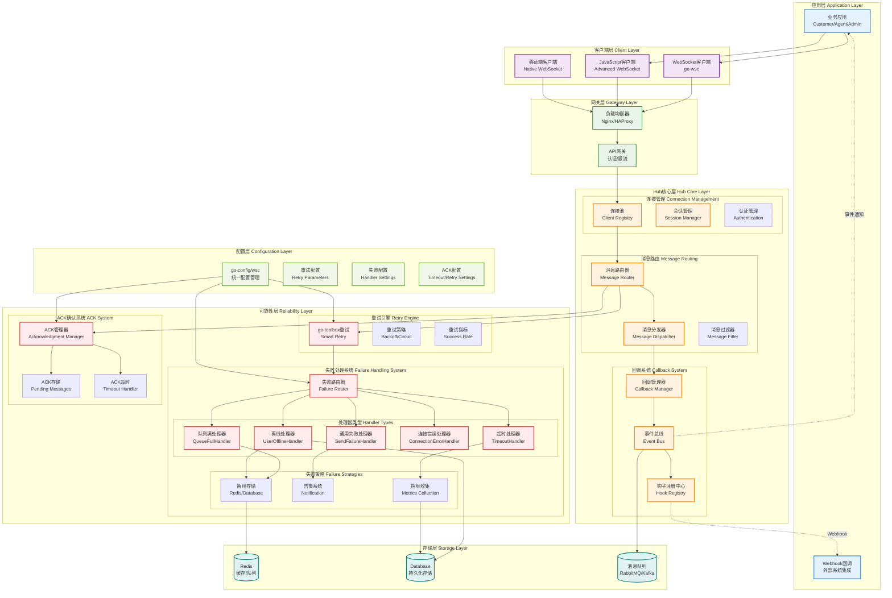
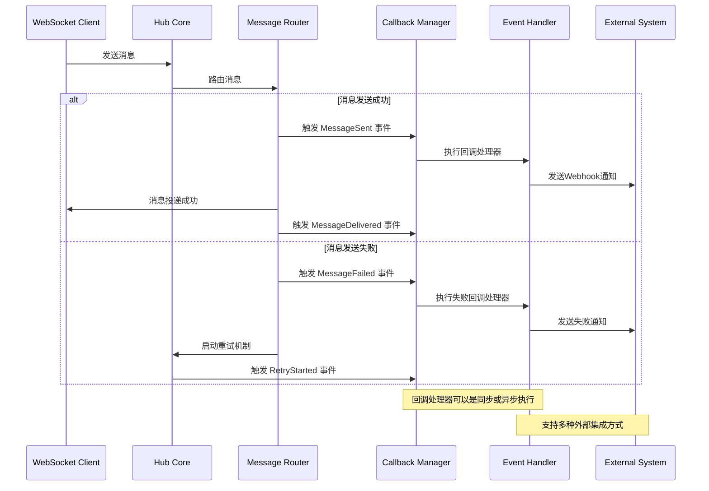
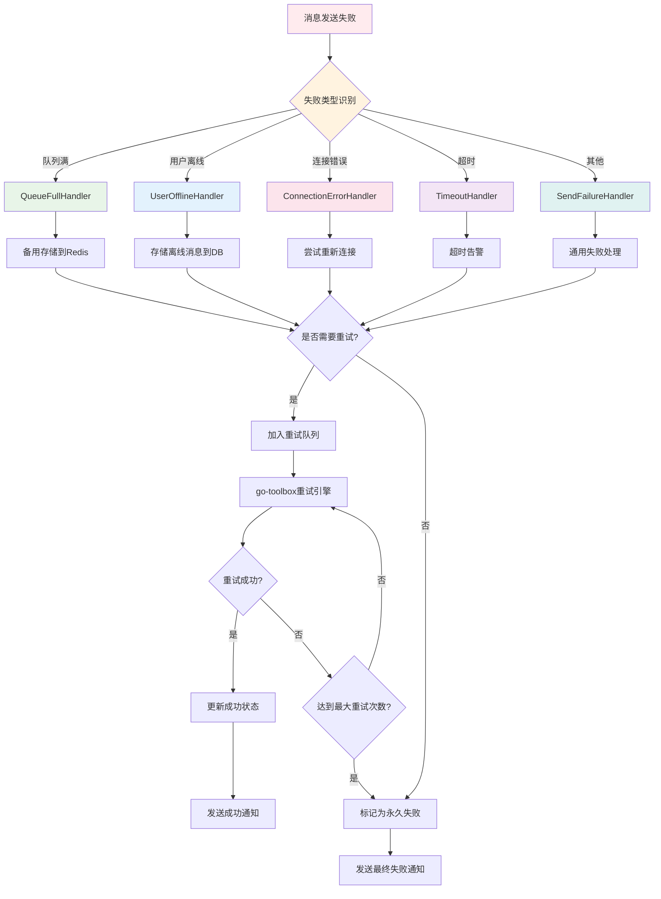

# WebSocket Hub 架构设计 - 回调与失败机制 🏗️

本文档详细介绍 go-wsc WebSocket Hub 的回调系统和失败处理机制的架构设计。

## 🎯 总体架构

### 架构层次图



## 🔄 回调系统架构

### 事件驱动模型

go-wsc 采用事件驱动的回调模型，支持多层次的回调机制：

```go
// 回调系统核心接口
type CallbackManager interface {
    // 注册回调
    RegisterCallback(event EventType, handler CallbackHandler) error
    
    // 触发回调
    TriggerCallback(event EventType, data interface{}) error
    
    // 移除回调
    UnregisterCallback(event EventType, handler CallbackHandler) error
}

// 回调事件类型
type EventType string

const (
    // 连接事件
    EventClientConnected    EventType = "client.connected"
    EventClientDisconnected EventType = "client.disconnected"
    EventClientReconnected  EventType = "client.reconnected"
    
    // 消息事件
    EventMessageSent        EventType = "message.sent"
    EventMessageReceived    EventType = "message.received"
    EventMessageDelivered   EventType = "message.delivered"
    EventMessageFailed      EventType = "message.failed"
    
    // ACK事件
    EventACKReceived        EventType = "ack.received"
    EventACKTimeout         EventType = "ack.timeout"
    EventACKRetry           EventType = "ack.retry"
    
    // 失败事件
    EventSendFailure        EventType = "failure.send"
    EventQueueFull          EventType = "failure.queue_full"
    EventUserOffline        EventType = "failure.user_offline"
    EventConnectionError    EventType = "failure.connection"
    EventTimeout            EventType = "failure.timeout"
    
    // 系统事件
    EventHubStarted         EventType = "hub.started"
    EventHubStopped         EventType = "hub.stopped"
    EventConfigChanged      EventType = "config.changed"
)

// 回调处理器接口
type CallbackHandler interface {
    HandleCallback(event EventType, data interface{}) error
}
```

### 回调执行流程



## 🚨 失败处理器架构

### 分层失败处理

```go
// 失败处理器注册中心
type FailureHandlerRegistry struct {
    sendFailureHandlers     []SendFailureHandler
    queueFullHandlers       []QueueFullHandler
    userOfflineHandlers     []UserOfflineHandler
    connectionErrorHandlers []ConnectionErrorHandler
    timeoutHandlers         []TimeoutHandler
    mutex                   sync.RWMutex
}

// 失败路由器 - 根据失败类型路由到对应处理器
type FailureRouter struct {
    registry *FailureHandlerRegistry
    metrics  *FailureMetrics
    logger   *FailureLogger
}

func (r *FailureRouter) RouteFailure(failure *FailureEvent) error {
    // 记录失败指标
    r.metrics.IncrementFailureCount(failure.Type)
    
    // 记录失败日志
    r.logger.LogFailure(failure)
    
    // 根据失败类型路由到对应处理器
    switch failure.Type {
    case FailureTypeQueueFull:
        return r.routeToQueueFullHandlers(failure)
    case FailureTypeUserOffline:
        return r.routeToUserOfflineHandlers(failure)
    case FailureTypeConnectionError:
        return r.routeToConnectionErrorHandlers(failure)
    case FailureTypeTimeout:
        return r.routeToTimeoutHandlers(failure)
    default:
        return r.routeToSendFailureHandlers(failure)
    }
}
```

### 失败处理器执行策略



## 🔧 配置驱动架构

### 统一配置管理

```go
// go-config/wsc 包的配置结构
type WSC struct {
    // Hub 基础配置
    MaxConnections    int           `yaml:"max_connections" json:"max_connections"`
    ReadBufferSize    int           `yaml:"read_buffer_size" json:"read_buffer_size"`
    WriteBufferSize   int           `yaml:"write_buffer_size" json:"write_buffer_size"`
    HandshakeTimeout  time.Duration `yaml:"handshake_timeout" json:"handshake_timeout"`
    
    // 重试配置
    MaxRetries        int             `yaml:"max_retries" json:"max_retries"`
    BaseDelay         time.Duration   `yaml:"base_delay" json:"base_delay"`
    BackoffFactor     float64         `yaml:"backoff_factor" json:"backoff_factor"`
    RetryableErrors   []string        `yaml:"retryable_errors" json:"retryable_errors"`
    NonRetryableErrors []string       `yaml:"non_retryable_errors" json:"non_retryable_errors"`
    
    // ACK 配置
    AckTimeout        time.Duration   `yaml:"ack_timeout" json:"ack_timeout"`
    AckMaxRetries     int             `yaml:"ack_max_retries" json:"ack_max_retries"`
    AckRetryInterval  time.Duration   `yaml:"ack_retry_interval" json:"ack_retry_interval"`
    EnableOfflineAck  bool            `yaml:"enable_offline_ack" json:"enable_offline_ack"`
    
    // 失败处理配置
    FailureHandlers   FailureHandlerConfig `yaml:"failure_handlers" json:"failure_handlers"`
    
    // 回调配置
    CallbackConfig    CallbackConfig       `yaml:"callbacks" json:"callbacks"`
}

type FailureHandlerConfig struct {
    EnableLogging     bool     `yaml:"enable_logging" json:"enable_logging"`
    EnableMetrics     bool     `yaml:"enable_metrics" json:"enable_metrics"`
    EnableAlert       bool     `yaml:"enable_alert" json:"enable_alert"`
    AlertThreshold    int      `yaml:"alert_threshold" json:"alert_threshold"`
    FallbackStorage   string   `yaml:"fallback_storage" json:"fallback_storage"`
    OfflineStorage    string   `yaml:"offline_storage" json:"offline_storage"`
}

type CallbackConfig struct {
    EnableWebhooks    bool              `yaml:"enable_webhooks" json:"enable_webhooks"`
    WebhookURL        string            `yaml:"webhook_url" json:"webhook_url"`
    WebhookTimeout    time.Duration     `yaml:"webhook_timeout" json:"webhook_timeout"`
    WebhookRetries    int               `yaml:"webhook_retries" json:"webhook_retries"`
    EventFilters      []string          `yaml:"event_filters" json:"event_filters"`
    Headers           map[string]string `yaml:"headers" json:"headers"`
}
```

### 配置热更新机制

```go
// 配置监听器
type ConfigWatcher struct {
    configPath   string
    callbacks    []func(*WSC)
    lastModified time.Time
    mutex        sync.RWMutex
}

func (w *ConfigWatcher) Watch() {
    ticker := time.NewTicker(5 * time.Second)
    defer ticker.Stop()
    
    for range ticker.C {
        if w.hasConfigChanged() {
            newConfig, err := w.loadConfig()
            if err != nil {
                log.Printf("配置加载失败: %v", err)
                continue
            }
            
            // 触发配置更新回调
            w.notifyConfigChanged(newConfig)
        }
    }
}

func (w *ConfigWatcher) notifyConfigChanged(config *WSC) {
    w.mutex.RLock()
    callbacks := make([]func(*WSC), len(w.callbacks))
    copy(callbacks, w.callbacks)
    w.mutex.RUnlock()
    
    for _, callback := range callbacks {
        go func(cb func(*WSC)) {
            defer func() {
                if r := recover(); r != nil {
                    log.Printf("配置回调执行失败: %v", r)
                }
            }()
            cb(config)
        }(callback)
    }
}

// Hub 配置更新处理
func (h *Hub) handleConfigUpdate(config *WSC) {
    log.Printf("🔧 应用新配置")
    
    // 更新重试参数
    h.updateRetryConfig(config)
    
    // 更新失败处理器配置
    h.updateFailureHandlerConfig(config)
    
    // 更新ACK配置
    h.updateACKConfig(config)
    
    // 更新回调配置
    h.updateCallbackConfig(config)
    
    // 触发配置变更事件
    h.callbackManager.TriggerCallback(EventConfigChanged, config)
}
```

## 📊 监控与指标

### 失败指标收集

```go
// 失败指标收集器
type FailureMetrics struct {
    totalFailures     *prometheus.CounterVec
    failuresByType    *prometheus.CounterVec
    failuresByReason  *prometheus.CounterVec
    retryAttempts     *prometheus.CounterVec
    retrySuccess      *prometheus.CounterVec
    handlerDuration   *prometheus.HistogramVec
    queueFullEvents   prometheus.Counter
    offlineEvents     prometheus.Counter
    timeoutEvents     prometheus.Counter
}

func NewFailureMetrics() *FailureMetrics {
    return &FailureMetrics{
        totalFailures: prometheus.NewCounterVec(
            prometheus.CounterOpts{
                Name: "wsc_total_failures_total",
                Help: "Total number of message send failures",
            },
            []string{"hub_id", "client_type"},
        ),
        
        failuresByType: prometheus.NewCounterVec(
            prometheus.CounterOpts{
                Name: "wsc_failures_by_type_total",
                Help: "Number of failures by type",
            },
            []string{"type", "hub_id"},
        ),
        
        handlerDuration: prometheus.NewHistogramVec(
            prometheus.HistogramOpts{
                Name: "wsc_failure_handler_duration_seconds",
                Help: "Duration of failure handler execution",
                Buckets: prometheus.DefBuckets,
            },
            []string{"handler_type"},
        ),
    }
}

func (m *FailureMetrics) IncrementFailureCount(failureType string) {
    m.failuresByType.WithLabelValues(failureType, "hub-1").Inc()
    m.totalFailures.WithLabelValues("hub-1", "websocket").Inc()
}
```

### 回调指标监控

```go
// 回调指标收集器
type CallbackMetrics struct {
    callbackExecutions *prometheus.CounterVec
    callbackDuration   *prometheus.HistogramVec
    callbackErrors     *prometheus.CounterVec
    webhookRequests    *prometheus.CounterVec
    webhookLatency     *prometheus.HistogramVec
}

func (m *CallbackMetrics) RecordCallbackExecution(eventType string, duration time.Duration, success bool) {
    labels := []string{eventType}
    
    m.callbackExecutions.WithLabelValues(labels...).Inc()
    m.callbackDuration.WithLabelValues(labels...).Observe(duration.Seconds())
    
    if !success {
        m.callbackErrors.WithLabelValues(labels...).Inc()
    }
}
```

## 🔍 故障排查与调试

### 调试接口

```go
// 调试信息接口
type DebugInfo struct {
    // 连接信息
    ActiveConnections  int                    `json:"active_connections"`
    TotalConnections   int64                  `json:"total_connections"`
    
    // 失败统计
    FailureStats      map[string]int64       `json:"failure_stats"`
    RetryStats        map[string]int64       `json:"retry_stats"`
    
    // 回调统计
    CallbackStats     map[string]int64       `json:"callback_stats"`
    
    // 配置信息
    CurrentConfig     *WSC                   `json:"current_config"`
    
    // 处理器状态
    HandlerStatus     map[string]interface{} `json:"handler_status"`
}

// HTTP调试端点
func setupDebugEndpoints(hub *Hub) {
    http.HandleFunc("/debug/hub/status", func(w http.ResponseWriter, r *http.Request) {
        debugInfo := hub.GetDebugInfo()
        w.Header().Set("Content-Type", "application/json")
        json.NewEncoder(w).Encode(debugInfo)
    })
    
    http.HandleFunc("/debug/failures", func(w http.ResponseWriter, r *http.Request) {
        failures := hub.GetRecentFailures(100)
        w.Header().Set("Content-Type", "application/json")
        json.NewEncoder(w).Encode(failures)
    })
    
    http.HandleFunc("/debug/callbacks", func(w http.ResponseWriter, r *http.Request) {
        callbacks := hub.GetRegisteredCallbacks()
        w.Header().Set("Content-Type", "application/json")
        json.NewEncoder(w).Encode(callbacks)
    })
}
```

### 日志记录

```go
// 结构化日志记录器
type StructuredLogger struct {
    logger *logrus.Logger
}

func (l *StructuredLogger) LogFailure(failure *FailureEvent) {
    l.logger.WithFields(logrus.Fields{
        "type":       failure.Type,
        "message_id": failure.MessageID,
        "user_id":    failure.UserID,
        "error":      failure.Error.Error(),
        "timestamp":  failure.Timestamp,
        "retry_count": failure.RetryCount,
    }).Error("消息发送失败")
}

func (l *StructuredLogger) LogCallback(event EventType, data interface{}, duration time.Duration, err error) {
    fields := logrus.Fields{
        "event":    string(event),
        "duration": duration.Milliseconds(),
    }
    
    if err != nil {
        fields["error"] = err.Error()
        l.logger.WithFields(fields).Error("回调执行失败")
    } else {
        l.logger.WithFields(fields).Info("回调执行成功")
    }
}
```

## 🚀 性能优化

### 异步处理优化

```go
// 异步任务池
type TaskPool struct {
    workers   int
    taskQueue chan func()
    wg        sync.WaitGroup
    shutdown  chan struct{}
}

func NewTaskPool(workers int, queueSize int) *TaskPool {
    return &TaskPool{
        workers:   workers,
        taskQueue: make(chan func(), queueSize),
        shutdown:  make(chan struct{}),
    }
}

func (p *TaskPool) Start() {
    for i := 0; i < p.workers; i++ {
        p.wg.Add(1)
        go p.worker()
    }
}

func (p *TaskPool) Submit(task func()) {
    select {
    case p.taskQueue <- task:
    case <-p.shutdown:
        // 如果池已关闭，直接执行任务
        go task()
    default:
        // 如果队列满了，启动新的goroutine执行
        go task()
    }
}

func (p *TaskPool) worker() {
    defer p.wg.Done()
    
    for {
        select {
        case task := <-p.taskQueue:
            func() {
                defer func() {
                    if r := recover(); r != nil {
                        log.Printf("任务执行panic: %v", r)
                    }
                }()
                task()
            }()
        case <-p.shutdown:
            return
        }
    }
}

// 在Hub中使用任务池
func (h *Hub) setupTaskPools() {
    // 失败处理任务池
    h.failureTaskPool = NewTaskPool(10, 1000)
    h.failureTaskPool.Start()
    
    // 回调执行任务池
    h.callbackTaskPool = NewTaskPool(5, 500)
    h.callbackTaskPool.Start()
    
    // ACK处理任务池
    h.ackTaskPool = NewTaskPool(3, 300)
    h.ackTaskPool.Start()
}
```

通过这个全面的架构设计，go-wsc 提供了高可靠、高性能、易扩展的 WebSocket 通信解决方案，特别是在回调机制和失败处理方面达到了企业级应用的要求。