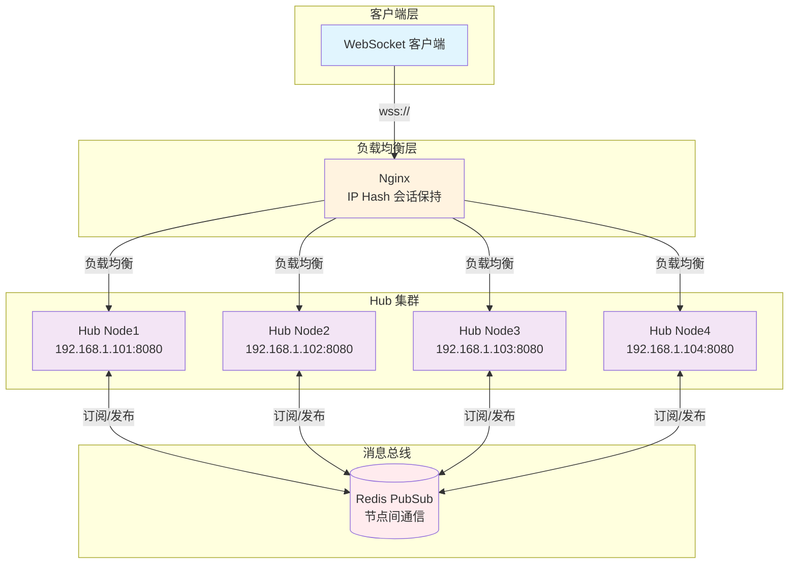
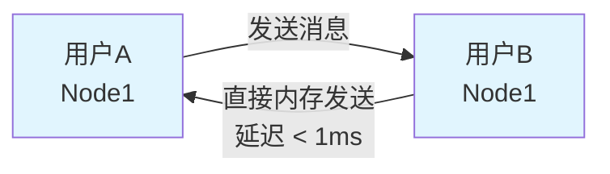
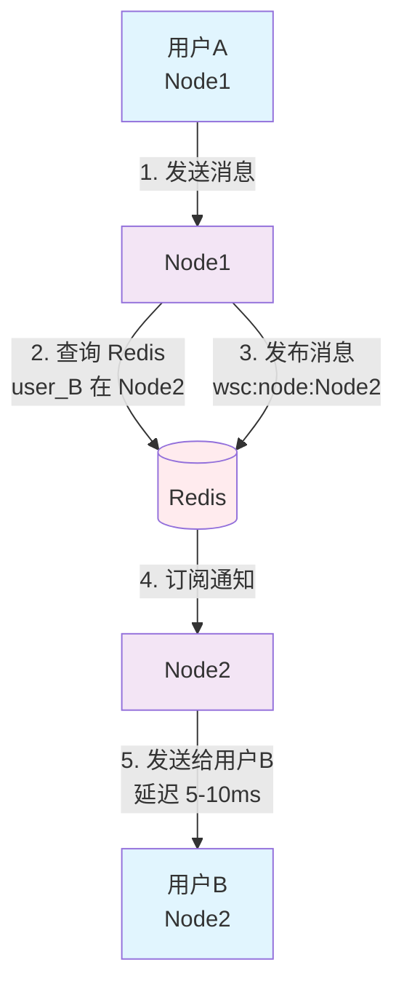
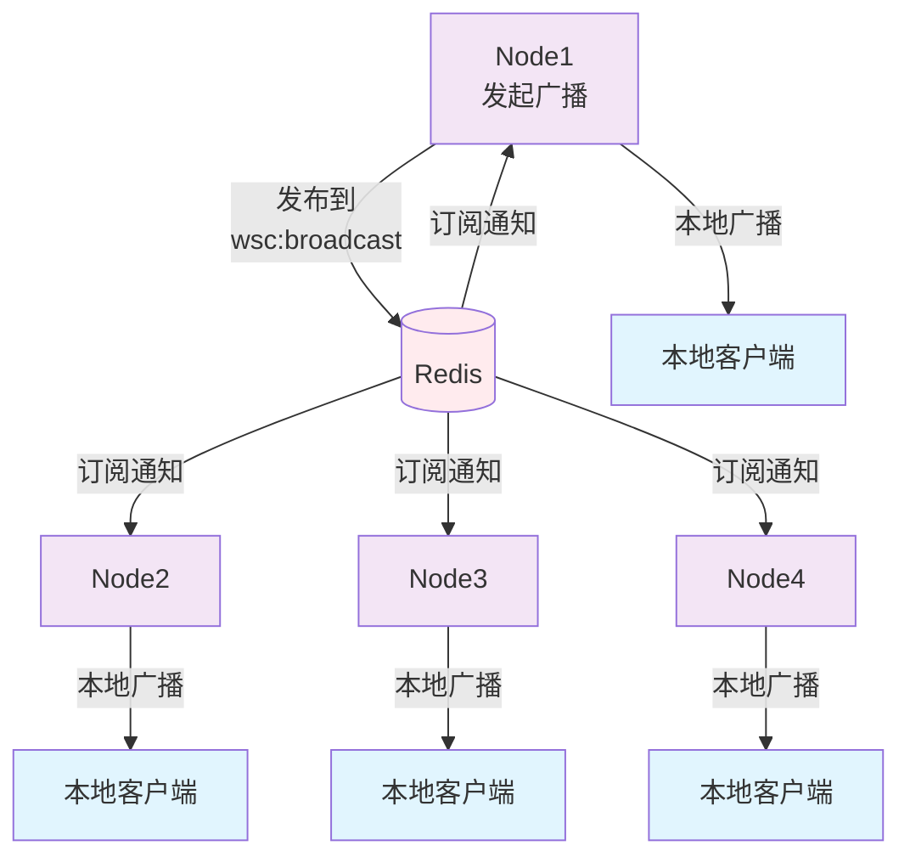

# WebSocket Hub 分布式架构使用指南

> **📘 相关文档**
> - [K8s 部署指南](./K8S_DEPLOYMENT.md) - Kubernetes 环境部署和配置

## 🎯 核心特性

**现有代码无需修改，自动支持分布式！**

- ✅ `SendToUserWithRetry` 自动跨节点路由
- ✅ `Broadcast` 自动广播到所有节点
- ✅ `KickUser` 自动踢出所有节点的连接
- ✅ 用户连接自动记录节点信息
- ✅ 节点自动注册和心跳

## 📊 架构图



## 🚀 快速开始

### 步骤 1: 部署 Nginx 负载均衡

```nginx
upstream websocket_backend {
    ip_hash;  # 会话亲和性
    
    server 192.168.1.101:8080;
    server 192.168.1.102:8080;
    server 192.168.1.103:8080;
}

server {
    listen 443 ssl;
    server_name ws.example.com;

    location /ws {
        proxy_pass http://websocket_backend;
        proxy_http_version 1.1;
        proxy_set_header Upgrade $http_upgrade;
        proxy_set_header Connection "upgrade";
        proxy_connect_timeout 7d;
        proxy_send_timeout 7d;
        proxy_read_timeout 7d;
    }
}
```

### 步骤 2: 启用 Redis PubSub

```go
package main

import (
    "context"
    "fmt"
    "log"
    "net/http"
    
    "github.com/kamalyes/go-cachex"
    wscconfig "github.com/kamalyes/go-config/pkg/wsc"
    "github.com/kamalyes/go-wsc"
    "github.com/redis/go-redis/v9"
)

func main() {
    ctx := context.Background()
    
    // 1. 配置
    config := &wscconfig.WSC{
        NodeIP:            "192.168.1.101",
        NodePort:          8080,
        MessageBufferSize: 256,
    }
    
    // 2. 创建 Redis 客户端
    redisClient := redis.NewClient(&redis.Options{
        Addr: "localhost:6379",
    })
    
    // 3. 创建 PubSub
    pubsub := cachex.NewPubSub(redisClient)
    
    // 4. 创建 Hub 并启用分布式
    hub := wsc.NewHub(config)
    hub.SetPubSub(pubsub)  // 🌐 启用分布式
    
    // 5. 启动 Hub
    go hub.Run()
    
    // 6. HTTP 路由
    http.HandleFunc("/ws", func(w http.ResponseWriter, r *http.Request) {
        userID := r.URL.Query().Get("user_id")
        wsc.ServeWs(hub, w, r, userID)
    })
    
    log.Printf("🚀 Hub 启动: %s:%d", config.NodeIP, config.NodePort)
    log.Fatal(http.ListenAndServe(fmt.Sprintf(":%d", config.NodePort), nil))
}
```

### 步骤 3: 正常使用，无需修改

```go
// 发送消息 - 自动跨节点路由
result := hub.SendToUserWithRetry(ctx, "user123", &wsc.HubMessage{
    MessageType: wsc.MessageTypeText,
    Content:     "Hello",
})

// 广播消息 - 自动广播到所有节点
hub.Broadcast(ctx, &wsc.HubMessage{
    MessageType: wsc.MessageTypeText,
    Content:     "系统通知",
})

// 踢人 - 自动踢出所有节点的连接
hub.KickUser("user123", "违规操作", true, "您已被踢出")
```

## 📡 消息流转

### 同节点通信



### 跨节点通信



### 全局广播



## 🔍 监控与调试

### 健康检查

```go
http.HandleFunc("/health", func(w http.ResponseWriter, r *http.Request) {
    health := hub.GetHealthInfo()
    json.NewEncoder(w).Encode(health)
})

// Response:
// {
//   "status": "healthy",
//   "is_running": true,
//   "websocket_count": 1523,
//   "node_id": "192.168.1.101:8080"
// }
```

### 查看所有节点

```go
http.HandleFunc("/nodes", func(w http.ResponseWriter, r *http.Request) {
    nodes, _ := hub.DiscoverNodes(ctx)
    json.NewEncoder(w).Encode(nodes)
})

// Response:
// [
//   {
//     "id": "192.168.1.101:8080",
//     "ip_address": "192.168.1.101",
//     "port": 8080,
//     "status": "active",
//     "connections": 1523
//   }
// ]
```

### 查看用户所在节点

```go
nodeID, _ := hub.GetOnlineStatusRepo().GetUserNode(ctx, "user123")
fmt.Printf("用户在节点: %s\n", nodeID)
```

## ⚡ 性能数据

### 延迟对比

| 通信类型 | 延迟 | 说明 |
|---------|------|------|
| 同节点通信 | < 1ms | 内存通信，无额外开销 |
| 跨节点通信 | 5-10ms | Redis PubSub 延迟 |

### 吞吐量对比

| 场景 | 吞吐量 | 瓶颈 |
|------|--------|------|
| 单机模式 | 720万/秒 | CPU/内存 |
| 分布式 - 同节点 | 720万/秒 | 无变化 |
| 分布式 - 跨节点 | 10万/秒 | Redis PubSub |
| 分布式 - 混合 (80%同节点) | 约 150万/秒 | 实际场景 |

**关键点：**
- 使用 IP Hash 可以让大部分消息在同节点通信
- 同节点通信性能与单机模式完全一致
- 跨节点通信受 Redis 限制，但可通过 Redis Cluster 优化

## 🛡️ 高可用

### 节点故障自动恢复

- **心跳间隔**: 10秒
- **超时时间**: 60秒
- **自动清理**: 故障节点的用户映射自动清理
- **客户端重连**: 自动重连到可用节点

### 客户端自动重连示例

```javascript
class WebSocketClient {
    constructor(url) {
        this.url = url;
        this.reconnectDelay = 1000;
        this.connect();
    }
    
    connect() {
        this.ws = new WebSocket(this.url);
        this.ws.onclose = () => this.scheduleReconnect();
    }
    
    scheduleReconnect() {
        setTimeout(() => {
            this.connect();
            this.reconnectDelay = Math.min(this.reconnectDelay * 2, 30000);
        }, this.reconnectDelay);
    }
}
```

## 📈 扩展性

### 并发连接支持

| 节点数 | 并发连接数 | 说明 |
|--------|-----------|------|
| 1节点  | 10K-50K   | 单机模式 |
| 4节点  | 40K-200K  | 线性扩展 |
| 10节点 | 100K-500K | 线性扩展 |

### 消息吞吐量

| 场景 | 吞吐量 | 说明 |
|------|--------|------|
| 同节点通信 | 720万/秒 | 内存通信，无瓶颈 |
| 跨节点通信 | 10万/秒 | 受 Redis PubSub 限制 |
| 混合场景 (80%同节点) | 约 150万/秒 | 实际生产环境 |

**说明：**
- 使用 IP Hash 可以让 80%+ 的消息在同节点通信
- Redis Cluster 可以将跨节点吞吐提升到 50万/秒+
- 实际吞吐量取决于跨节点消息的比例

## 💡 优化建议

### 1. 使用 IP Hash 保证会话亲和性

```nginx
upstream websocket_backend {
    ip_hash;  # 减少跨节点通信
    server node1:8080;
    server node2:8080;
}
```

### 2. 使用 Redis Cluster

```go
redisClient := redis.NewClusterClient(&redis.ClusterOptions{
    Addrs: []string{
        "redis-node1:6379",
        "redis-node2:6379",
        "redis-node3:6379",
    },
})
```

### 3. 启用本地缓存

减少 Redis 查询，提高性能。

## 🎉 总结

### 启用分布式只需 3 步

1. ✅ 部署 Nginx 负载均衡
2. ✅ 设置 PubSub: `hub.SetPubSub(pubsub)`
3. ✅ 正常使用现有 API

### 自动支持

- 跨节点消息路由
- 全局广播
- 节点注册和发现
- 故障检测和恢复

### 核心优势

- **零侵入**: 现有代码无需修改
- **自动化**: 自动路由、自动注册、自动心跳
- **高性能**: 同节点通信无额外开销
- **高可用**: 节点故障自动恢复
