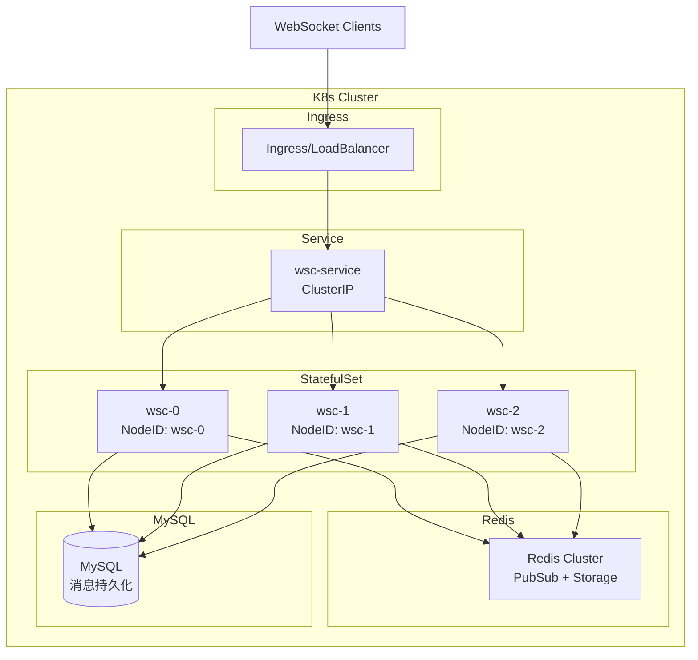
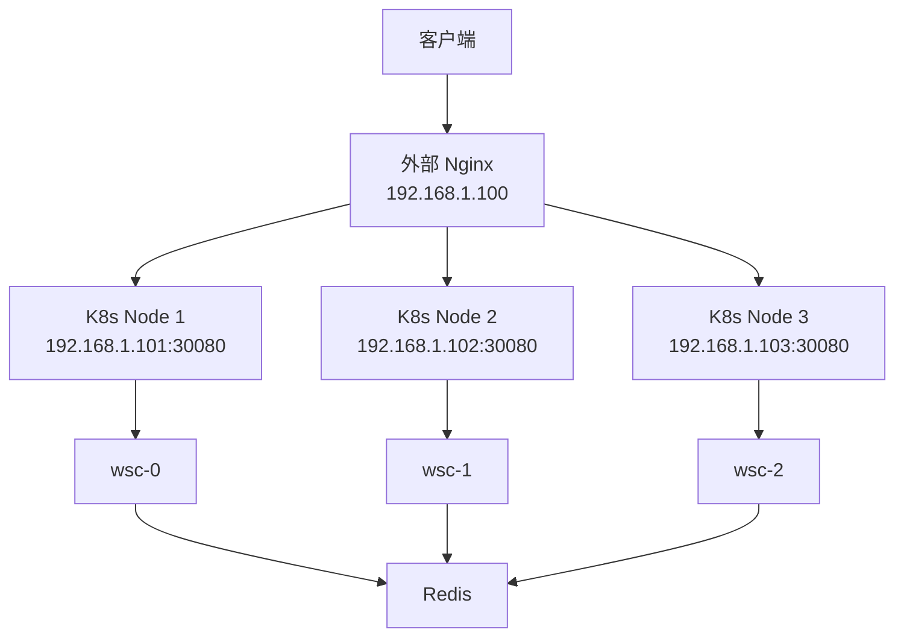

# Kubernetes 部署指南

本文档说明如何在 Kubernetes 环境中部署 go-wsc 分布式 WebSocket 服务。

## 核心特性

- ✅ **自动节点识别**：使用 Pod Name 作为节点ID，重启后保持一致
- ✅ **StatefulSet 支持**：适配有状态服务部署
- ✅ **Service 负载均衡**：支持多 Pod 水平扩展
- ✅ **Redis 集群**：跨节点消息路由和状态同步
- ✅ **健康检查**：Liveness 和 Readiness 探针
- ✅ **优雅关闭**：Pod 终止时正确清理连接

## 架构图



## 快速开始

### 1. 前置依赖

确保你的 K8s 集群中已部署：

- **Redis**：用于分布式协调和消息路由
  - 推荐使用 [Bitnami Redis Helm Chart](https://github.com/bitnami/charts/tree/main/bitnami/redis)
  - 或使用云服务商的 Redis（如 AWS ElastiCache、阿里云 Redis）
  
- **MySQL**（可选）：用于消息持久化
  - 推荐使用 [Bitnami MySQL Helm Chart](https://github.com/bitnami/charts/tree/main/bitnami/mysql)

```bash
# 使用 Helm 快速部署 Redis
helm repo add bitnami https://charts.bitnami.com/bitnami
helm install redis bitnami/redis --namespace wsc --create-namespace

# 获取 Redis 密码
export REDIS_PASSWORD=$(kubectl get secret --namespace wsc redis -o jsonpath="{.data.redis-password}" | base64 -d)
```

### 2. 部署 WebSocket 服务

#### 方案选择：StatefulSet vs Deployment

| 特性 | StatefulSet | Deployment |
|------|-------------|------------|
| **Pod Name** | 稳定（wsc-0, wsc-1） | 随机（wsc-7d8f9-abc） |
| **节点ID** | 固定不变 | 每次重启变化 |
| **适用场景** | 需要稳定节点标识 | 无状态服务 |
| **推荐度** | ⭐⭐⭐⭐⭐ | ⭐⭐⭐⭐ |

**结论**：两种都可以！
- **StatefulSet**：节点ID固定，便于调试和监控（推荐）
- **Deployment**：更灵活，Pod 重启后自动获取新ID（也完全支持）

#### 方案一：StatefulSet（推荐 - 节点ID稳定）

```yaml
# wsc-statefulset.yaml
apiVersion: apps/v1
kind: StatefulSet
metadata:
  name: wsc
  namespace: wsc
spec:
  serviceName: wsc
  replicas: 3
  selector:
    matchLabels:
      app: wsc
  template:
    metadata:
      labels:
        app: wsc
    spec:
      containers:
      - name: wsc
        image: your-registry/go-wsc:latest
        ports:
        - containerPort: 8080
          name: http
        - containerPort: 8081
          name: metrics
        env:
        # K8s 环境变量（自动注入 Pod Name）
        - name: POD_NAME
          valueFrom:
            fieldRef:
              fieldPath: metadata.name
        - name: POD_NAMESPACE
          valueFrom:
            fieldRef:
              fieldPath: metadata.namespace
        - name: POD_IP
          valueFrom:
            fieldRef:
              fieldPath: status.podIP
        
        # 应用配置
        - name: WSC_NODE_IP
          valueFrom:
            fieldRef:
              fieldPath: status.podIP
        - name: WSC_NODE_PORT
          value: "8080"
        - name: REDIS_ADDR
          value: "redis:6379"
        - name: REDIS_PASSWORD
          valueFrom:
            secretKeyRef:
              name: redis-secret
              key: password
              optional: true
        
        resources:
          requests:
            memory: "512Mi"
            cpu: "500m"
          limits:
            memory: "1Gi"
            cpu: "1000m"
        
        # 健康检查
        livenessProbe:
          httpGet:
            path: /health
            port: 8080
          initialDelaySeconds: 30
          periodSeconds: 10
          timeoutSeconds: 5
          failureThreshold: 3
        
        readinessProbe:
          httpGet:
            path: /ready
            port: 8080
          initialDelaySeconds: 10
          periodSeconds: 5
          timeoutSeconds: 3
          failureThreshold: 2
        
        # 优雅关闭
        lifecycle:
          preStop:
            exec:
              command: ["/bin/sh", "-c", "sleep 15"]
---
apiVersion: v1
kind: Service
metadata:
  name: wsc
  namespace: wsc
spec:
  selector:
    app: wsc
  ports:
  - port: 8080
    targetPort: 8080
    name: http
  - port: 8081
    targetPort: 8081
    name: metrics
  type: ClusterIP
  sessionAffinity: ClientIP  # 会话保持（可选）
  sessionAffinityConfig:
    clientIP:
      timeoutSeconds: 10800  # 3小时
```

#### 方案二：Deployment（更灵活 - 节点ID动态）

```yaml
# wsc-deployment.yaml
apiVersion: apps/v1
kind: Deployment
metadata:
  name: wsc
  namespace: wsc
spec:
  replicas: 3
  selector:
    matchLabels:
      app: wsc
  template:
    metadata:
      labels:
        app: wsc
    spec:
      containers:
      - name: wsc
        image: your-registry/go-wsc:latest
        ports:
        - containerPort: 8080
          name: http
        env:
        # K8s 环境变量（Deployment 使用 HOSTNAME）
        - name: HOSTNAME
          valueFrom:
            fieldRef:
              fieldPath: metadata.name
        - name: POD_IP
          valueFrom:
            fieldRef:
              fieldPath: status.podIP
        
        # 应用配置
        - name: WSC_NODE_IP
          valueFrom:
            fieldRef:
              fieldPath: status.podIP
        - name: WSC_NODE_PORT
          value: "8080"
        - name: REDIS_ADDR
          value: "redis:6379"
        
        resources:
          requests:
            memory: "512Mi"
            cpu: "500m"
          limits:
            memory: "1Gi"
            cpu: "1000m"
        
        livenessProbe:
          httpGet:
            path: /health
            port: 8080
          initialDelaySeconds: 30
          periodSeconds: 10
        
        readinessProbe:
          httpGet:
            path: /ready
            port: 8080
          initialDelaySeconds: 10
          periodSeconds: 5
        
        lifecycle:
          preStop:
            exec:
              command: ["/bin/sh", "-c", "sleep 15"]
---
apiVersion: v1
kind: Service
metadata:
  name: wsc
  namespace: wsc
spec:
  selector:
    app: wsc
  ports:
  - port: 8080
    targetPort: 8080
  type: ClusterIP
  sessionAffinity: ClientIP
  sessionAffinityConfig:
    clientIP:
      timeoutSeconds: 10800
```

**Deployment 说明**：
- Pod Name 格式：`wsc-7d8f9c-abc12`（随机后缀）
- 节点ID 使用 HOSTNAME（每次重启会变化）
- Redis 会自动更新节点信息
- 跨节点消息路由完全正常工作

### 3. 配置负载均衡

#### 方案一：Ingress（K8s 原生 - 推荐）

```yaml
# wsc-ingress.yaml
apiVersion: networking.k8s.io/v1
kind: Ingress
metadata:
  name: wsc-ingress
  namespace: wsc
  annotations:
    # Nginx Ingress 配置
    nginx.ingress.kubernetes.io/proxy-read-timeout: "3600"
    nginx.ingress.kubernetes.io/proxy-send-timeout: "3600"
    nginx.ingress.kubernetes.io/websocket-services: "wsc"
    
    # 会话保持（推荐）
    nginx.ingress.kubernetes.io/affinity: "cookie"
    nginx.ingress.kubernetes.io/session-cookie-name: "wsc-session"
    nginx.ingress.kubernetes.io/session-cookie-max-age: "10800"
    
    # SSL 配置（生产环境）
    cert-manager.io/cluster-issuer: "letsencrypt-prod"
spec:
  ingressClassName: nginx
  tls:
  - hosts:
    - ws.example.com
    secretName: wsc-tls
  rules:
  - host: ws.example.com
    http:
      paths:
      - path: /ws
        pathType: Prefix
        backend:
          service:
            name: wsc
            port:
              number: 8080
```

#### 方案二：传统 Nginx（外部负载均衡）

**步骤 1：暴露 K8s Service（NodePort）**

```yaml
# wsc-service-nodeport.yaml
apiVersion: v1
kind: Service
metadata:
  name: wsc-nodeport
  namespace: wsc
spec:
  type: NodePort
  selector:
    app: wsc
  ports:
  - port: 8080
    targetPort: 8080
    nodePort: 30080  # 可选，不指定则自动分配 30000-32767
  sessionAffinity: ClientIP
  sessionAffinityConfig:
    clientIP:
      timeoutSeconds: 10800
```

**步骤 2：配置外部 Nginx**

```nginx
# /etc/nginx/conf.d/wsc.conf
upstream wsc_backend {
    # K8s 节点列表（替换为你的实际节点IP）
    server 192.168.1.101:30080;
    server 192.168.1.102:30080;
    server 192.168.1.103:30080;
    
    # 会话保持（基于 IP Hash）
    ip_hash;
    
    # 或使用一致性哈希（需要 nginx-plus 或编译模块）
    # hash $remote_addr consistent;
}

# WebSocket 配置
map $http_upgrade $connection_upgrade {
    default upgrade;
    '' close;
}

server {
    listen 80;
    server_name ws.example.com;
    
    # 重定向到 HTTPS
    return 301 https://$server_name$request_uri;
}

server {
    listen 443 ssl http2;
    server_name ws.example.com;
    
    # SSL 证书
    ssl_certificate /etc/nginx/ssl/ws.example.com.crt;
    ssl_certificate_key /etc/nginx/ssl/ws.example.com.key;
    ssl_protocols TLSv1.2 TLSv1.3;
    ssl_ciphers HIGH:!aNULL:!MD5;
    
    # WebSocket 路由
    location /ws {
        proxy_pass http://wsc_backend;
        
        # WebSocket 必需配置
        proxy_http_version 1.1;
        proxy_set_header Upgrade $http_upgrade;
        proxy_set_header Connection $connection_upgrade;
        
        # 超时配置
        proxy_connect_timeout 60s;
        proxy_send_timeout 3600s;
        proxy_read_timeout 3600s;
        
        # 传递客户端信息
        proxy_set_header Host $host;
        proxy_set_header X-Real-IP $remote_addr;
        proxy_set_header X-Forwarded-For $proxy_add_x_forwarded_for;
        proxy_set_header X-Forwarded-Proto $scheme;
        
        # 禁用缓冲（WebSocket 必需）
        proxy_buffering off;
    }
    
    # 健康检查
    location /health {
        proxy_pass http://wsc_backend;
        proxy_http_version 1.1;
        proxy_set_header Host $host;
    }
}
```

**步骤 3：重载 Nginx**

```bash
# 测试配置
nginx -t

# 重载配置
nginx -s reload
```

#### 方案三：LoadBalancer Service（云环境）

```yaml
# wsc-service-lb.yaml
apiVersion: v1
kind: Service
metadata:
  name: wsc-lb
  namespace: wsc
  annotations:
    # AWS ELB 配置
    service.beta.kubernetes.io/aws-load-balancer-type: "nlb"
    service.beta.kubernetes.io/aws-load-balancer-backend-protocol: "tcp"
    
    # 阿里云 SLB 配置
    # service.beta.kubernetes.io/alibaba-cloud-loadbalancer-spec: "slb.s2.small"
    
    # 腾讯云 CLB 配置
    # service.kubernetes.io/qcloud-loadbalancer-internal-subnetid: "subnet-xxx"
spec:
  type: LoadBalancer
  selector:
    app: wsc
  ports:
  - port: 80
    targetPort: 8080
    protocol: TCP
  sessionAffinity: ClientIP
  sessionAffinityConfig:
    clientIP:
      timeoutSeconds: 10800
```

然后在云服务商的负载均衡器上配置 SSL 和域名。

#### 方案对比

| 方案 | 优点 | 缺点 | 适用场景 |
|------|------|------|----------|
| **Ingress** | ✅ K8s 原生<br/>✅ 自动管理<br/>✅ SSL 自动续期 | ⚠️ 需要 Ingress Controller | K8s 集群内 |
| **外部 Nginx** | ✅ 灵活配置<br/>✅ 熟悉的工具<br/>✅ 独立管理 | ❌ 需要手动维护<br/>❌ 需要暴露 NodePort | 传统运维团队 |
| **LoadBalancer** | ✅ 云原生<br/>✅ 自动分配 IP<br/>✅ 高可用 | ❌ 云服务商绑定<br/>💰 额外费用 | 云环境 |

### 4. 部署命令

#### 使用 StatefulSet

```bash
# 创建命名空间
kubectl create namespace wsc

# 部署 WebSocket 服务
kubectl apply -f wsc-statefulset.yaml

# 配置 Ingress
kubectl apply -f wsc-ingress.yaml

# 查看状态
kubectl get pods -n wsc
# 输出：wsc-0, wsc-1, wsc-2
```

#### 使用 Deployment

```bash
# 创建命名空间
kubectl create namespace wsc

# 部署 WebSocket 服务
kubectl apply -f wsc-deployment.yaml

# 配置 Ingress
kubectl apply -f wsc-ingress.yaml

# 查看状态
kubectl get pods -n wsc
# 输出：wsc-7d8f9c-abc12, wsc-7d8f9c-def34, wsc-7d8f9c-ghi56
```

#### 查看日志和状态

```bash
# 查看所有 Pod
kubectl get pods -n wsc -o wide

# 查看日志
kubectl logs -f -l app=wsc -n wsc

# 查看节点注册信息（Redis）
kubectl exec -it redis-0 -n wsc -- redis-cli
> KEYS wsc:nodes:*
> GET wsc:nodes:wsc-0  # StatefulSet
> GET wsc:nodes:wsc-7d8f9c-abc12  # Deployment
```

## 节点ID生成策略

### 优先级顺序

代码会按以下优先级自动选择节点ID：

1. **POD_NAME**（StatefulSet 推荐）
   ```
   wsc-0, wsc-1, wsc-2
   ```

2. **HOSTNAME**（Deployment 自动使用）
   ```
   wsc-7d8f9c-abc12, wsc-7d8f9c-def34
   ```

3. **NODE_ID**（自定义环境变量）
   ```
   export NODE_ID=custom-node-1
   ```

4. **IP:Port**（回退方案）
   ```
   10.244.1.5-8080
   ```

### StatefulSet vs Deployment 对比

| 维度 | StatefulSet | Deployment |
|------|-------------|------------|
| **节点ID示例** | `wsc-0` | `wsc-7d8f9c-abc12` |
| **Pod 重启** | ID不变（wsc-0） | ID变化（新随机后缀） |
| **扩缩容** | 有序（wsc-3, wsc-4） | 随机（新随机后缀） |
| **调试友好度** | ⭐⭐⭐⭐⭐ | ⭐⭐⭐ |
| **灵活性** | ⭐⭐⭐ | ⭐⭐⭐⭐⭐ |
| **分布式功能** | ✅ 完全支持 | ✅ 完全支持 |
| **推荐场景** | 需要稳定标识 | 无状态服务 |

### 两种方案都完全支持分布式！

**关键点**：
- ✅ 无论使用哪种方案，分布式功能都正常工作
- ✅ Redis 会自动更新节点信息
- ✅ 跨节点消息路由自动适配
- ✅ 节点发现和心跳自动处理

**选择建议**：
- 如果你需要**稳定的节点标识**（便于监控、调试）→ 使用 **StatefulSet**
- 如果你的服务**完全无状态**（不关心节点ID）→ 使用 **Deployment**

## 传统 Nginx 部署完整示例

### 场景说明

如果你的团队：
- ✅ 已有成熟的 Nginx 运维经验
- ✅ 不想使用 Ingress Controller
- ✅ 需要更灵活的负载均衡配置
- ✅ 需要在 K8s 外部统一管理流量

可以使用传统 Nginx 作为外部负载均衡器。

### 架构图



### 完整部署步骤

#### 1. 部署 K8s Service（NodePort）

```yaml
# wsc-service-nodeport.yaml
apiVersion: v1
kind: Service
metadata:
  name: wsc
  namespace: wsc
spec:
  type: NodePort
  selector:
    app: wsc
  ports:
  - name: http
    port: 8080
    targetPort: 8080
    nodePort: 30080  # 固定端口，便于 Nginx 配置
  - name: metrics
    port: 8081
    targetPort: 8081
    nodePort: 30081
  sessionAffinity: ClientIP
  sessionAffinityConfig:
    clientIP:
      timeoutSeconds: 10800
```

```bash
kubectl apply -f wsc-service-nodeport.yaml
```

#### 2. 获取 K8s 节点 IP

```bash
# 获取所有节点 IP
kubectl get nodes -o wide

# 输出示例：
# NAME     STATUS   ROLES    INTERNAL-IP     EXTERNAL-IP
# node-1   Ready    <none>   192.168.1.101   <none>
# node-2   Ready    <none>   192.168.1.102   <none>
# node-3   Ready    <none>   192.168.1.103   <none>
```

#### 3. 配置外部 Nginx

**主配置文件** (`/etc/nginx/nginx.conf`)

```nginx
user nginx;
worker_processes auto;
error_log /var/log/nginx/error.log warn;
pid /var/run/nginx.pid;

events {
    worker_connections 10000;
    use epoll;
}

http {
    include /etc/nginx/mime.types;
    default_type application/octet-stream;
    
    log_format main '$remote_addr - $remote_user [$time_local] "$request" '
                    '$status $body_bytes_sent "$http_referer" '
                    '"$http_user_agent" "$http_x_forwarded_for"';
    
    access_log /var/log/nginx/access.log main;
    
    sendfile on;
    tcp_nopush on;
    tcp_nodelay on;
    keepalive_timeout 65;
    types_hash_max_size 2048;
    
    # 包含站点配置
    include /etc/nginx/conf.d/*.conf;
}
```

**WebSocket 站点配置** (`/etc/nginx/conf.d/wsc.conf`)

```nginx
# K8s 后端服务器组
upstream wsc_backend {
    # K8s 节点列表（NodePort 30080）
    server 192.168.1.101:30080 max_fails=3 fail_timeout=30s;
    server 192.168.1.102:30080 max_fails=3 fail_timeout=30s;
    server 192.168.1.103:30080 max_fails=3 fail_timeout=30s;
    
    # 会话保持策略
    ip_hash;  # 基于客户端 IP 的会话保持
    
    # 健康检查（需要 nginx-plus 或 nginx-upstream-check-module）
    # check interval=3000 rise=2 fall=3 timeout=1000 type=http;
    # check_http_send "GET /health HTTP/1.0\r\n\r\n";
    # check_http_expect_alive http_2xx http_3xx;
    
    # 长连接配置
    keepalive 32;
}

# WebSocket 升级映射
map $http_upgrade $connection_upgrade {
    default upgrade;
    '' close;
}

# HTTP 重定向到 HTTPS
server {
    listen 80;
    server_name ws.example.com;
    
    # ACME 验证（Let's Encrypt）
    location /.well-known/acme-challenge/ {
        root /var/www/certbot;
    }
    
    # 其他请求重定向到 HTTPS
    location / {
        return 301 https://$server_name$request_uri;
    }
}

# HTTPS + WebSocket
server {
    listen 443 ssl http2;
    server_name ws.example.com;
    
    # SSL 证书配置
    ssl_certificate /etc/nginx/ssl/ws.example.com.crt;
    ssl_certificate_key /etc/nginx/ssl/ws.example.com.key;
    
    # SSL 安全配置
    ssl_protocols TLSv1.2 TLSv1.3;
    ssl_ciphers 'ECDHE-ECDSA-AES128-GCM-SHA256:ECDHE-RSA-AES128-GCM-SHA256:ECDHE-ECDSA-AES256-GCM-SHA384:ECDHE-RSA-AES256-GCM-SHA384';
    ssl_prefer_server_ciphers on;
    ssl_session_cache shared:SSL:10m;
    ssl_session_timeout 10m;
    
    # HSTS
    add_header Strict-Transport-Security "max-age=31536000; includeSubDomains" always;
    
    # WebSocket 路由
    location /ws {
        proxy_pass http://wsc_backend;
        
        # WebSocket 必需配置
        proxy_http_version 1.1;
        proxy_set_header Upgrade $http_upgrade;
        proxy_set_header Connection $connection_upgrade;
        
        # 超时配置（重要！）
        proxy_connect_timeout 60s;
        proxy_send_timeout 3600s;      # 1小时
        proxy_read_timeout 3600s;      # 1小时
        
        # 传递客户端信息
        proxy_set_header Host $host;
        proxy_set_header X-Real-IP $remote_addr;
        proxy_set_header X-Forwarded-For $proxy_add_x_forwarded_for;
        proxy_set_header X-Forwarded-Proto $scheme;
        proxy_set_header X-Forwarded-Host $host;
        proxy_set_header X-Forwarded-Port $server_port;
        
        # 禁用缓冲（WebSocket 必需）
        proxy_buffering off;
        
        # 禁用请求体大小限制
        client_max_body_size 0;
    }
    
    # 健康检查端点
    location /health {
        proxy_pass http://wsc_backend;
        proxy_http_version 1.1;
        proxy_set_header Host $host;
        proxy_connect_timeout 5s;
        proxy_read_timeout 5s;
        access_log off;
    }
    
    # Prometheus 监控（可选）
    location /metrics {
        proxy_pass http://wsc_backend;
        proxy_http_version 1.1;
        proxy_set_header Host $host;
        
        # 限制访问（仅内网）
        allow 192.168.0.0/16;
        allow 10.0.0.0/8;
        deny all;
    }
}
```

#### 4. 测试和重载 Nginx

```bash
# 测试配置文件
nginx -t

# 重载配置
nginx -s reload

# 查看日志
tail -f /var/log/nginx/access.log
tail -f /var/log/nginx/error.log
```

#### 5. 验证部署

```bash
# 测试 HTTP 重定向
curl -I http://ws.example.com/ws

# 测试 WebSocket 连接
wscat -c wss://ws.example.com/ws

# 测试健康检查
curl https://ws.example.com/health
```

### 高级配置

#### 1. 基于 Cookie 的会话保持

```nginx
upstream wsc_backend {
    server 192.168.1.101:30080;
    server 192.168.1.102:30080;
    server 192.168.1.103:30080;
    
    # 不使用 ip_hash
}

server {
    # ... 其他配置 ...
    
    location /ws {
        # 基于 Cookie 的会话保持
        proxy_pass http://wsc_backend;
        
        # 设置 Cookie
        add_header Set-Cookie "wsc_route=$upstream_addr; Path=/; HttpOnly; Secure";
        
        # 其他配置...
    }
}
```

#### 2. 限流配置

```nginx
# 限制每个 IP 的连接数
limit_conn_zone $binary_remote_addr zone=conn_limit:10m;

# 限制每个 IP 的请求速率
limit_req_zone $binary_remote_addr zone=req_limit:10m rate=10r/s;

server {
    location /ws {
        # 限制并发连接数
        limit_conn conn_limit 10;
        
        # 限制请求速率
        limit_req zone=req_limit burst=20 nodelay;
        
        proxy_pass http://wsc_backend;
        # ... 其他配置 ...
    }
}
```

#### 3. 日志增强

```nginx
# 自定义日志格式
log_format websocket '$remote_addr - $remote_user [$time_local] '
                     '"$request" $status $body_bytes_sent '
                     '"$http_referer" "$http_user_agent" '
                     'upstream: $upstream_addr '
                     'upstream_status: $upstream_status '
                     'request_time: $request_time '
                     'upstream_response_time: $upstream_response_time';

server {
    location /ws {
        access_log /var/log/nginx/websocket.log websocket;
        proxy_pass http://wsc_backend;
        # ... 其他配置 ...
    }
}
```

### 监控和运维

#### 查看连接状态

```bash
# 查看 Nginx 状态（需要配置 stub_status）
curl http://localhost/nginx_status

# 查看 K8s Service 端点
kubectl get endpoints wsc -n wsc

# 查看 Pod 状态
kubectl get pods -n wsc -o wide
```

#### 故障排查

```bash
# 1. 检查 Nginx 配置
nginx -t

# 2. 检查 Nginx 日志
tail -f /var/log/nginx/error.log

# 3. 测试 NodePort 连通性
curl http://192.168.1.101:30080/health
curl http://192.168.1.102:30080/health
curl http://192.168.1.103:30080/health

# 4. 检查防火墙
iptables -L -n | grep 30080

# 5. 测试 WebSocket 连接
wscat -c ws://192.168.1.101:30080/ws
```

### 优缺点对比

#### 优点
- ✅ 灵活的配置（限流、日志、缓存等）
- ✅ 团队熟悉的工具
- ✅ 独立于 K8s 的流量管理
- ✅ 可以统一管理多个 K8s 集群

#### 缺点
- ❌ 需要手动维护 Nginx 配置
- ❌ 需要手动更新后端节点列表
- ❌ 需要暴露 NodePort（安全性考虑）
- ❌ 无法自动感知 Pod 变化

### 最佳实践

1. **使用固定 NodePort**：便于 Nginx 配置
2. **配置健康检查**：自动剔除故障节点
3. **启用会话保持**：确保 WebSocket 连接稳定
4. **监控日志**：及时发现问题
5. **定期更新配置**：K8s 节点变化时更新 Nginx

## 配置示例

### 应用配置（config.yaml）

```yaml
# config.yaml
server:
  node_ip: ${POD_IP}
  node_port: 8080
  
redis:
  addr: redis:6379
  password: ${REDIS_PASSWORD}
  db: 0
  
distributed:
  enabled: true
  node_discovery_interval: 10s
  heartbeat_interval: 5s
  
websocket:
  max_connections: 10000
  message_buffer_size: 1000
  heartbeat_interval: 30s
```

### ConfigMap

```yaml
apiVersion: v1
kind: ConfigMap
metadata:
  name: wsc-config
  namespace: wsc
data:
  config.yaml: |
    server:
      node_ip: ${POD_IP}
      node_port: 8080
    redis:
      addr: redis:6379
      db: 0
    distributed:
      enabled: true
```

## 监控和调试

### 查看节点状态

```bash
# 查看所有 Pod
kubectl get pods -n wsc -o wide

# 查看节点注册信息（Redis）
kubectl exec -it redis-0 -n wsc -- redis-cli
> KEYS wsc:nodes:*
> GET wsc:nodes:wsc-0
```

### 查看日志

```bash
# 查看特定 Pod 日志
kubectl logs -f wsc-0 -n wsc

# 查看所有 Pod 日志
kubectl logs -f -l app=wsc -n wsc --all-containers=true

# 查看最近的错误
kubectl logs --tail=100 wsc-0 -n wsc | grep ERROR
```

### 性能监控

```bash
# 查看资源使用
kubectl top pods -n wsc

# 查看节点连接数
kubectl exec -it wsc-0 -n wsc -- curl localhost:8081/metrics
```

## 扩缩容

### 水平扩展

#### StatefulSet 扩展

```bash
# 扩展到 5 个副本（有序：wsc-3, wsc-4）
kubectl scale statefulset wsc --replicas=5 -n wsc

# 查看扩展状态
kubectl rollout status statefulset/wsc -n wsc

# 缩容到 2 个副本（删除 wsc-4, wsc-3, wsc-2）
kubectl scale statefulset wsc --replicas=2 -n wsc
```

#### Deployment 扩展

```bash
# 扩展到 5 个副本（随机 Pod Name）
kubectl scale deployment wsc --replicas=5 -n wsc

# 查看扩展状态
kubectl rollout status deployment/wsc -n wsc

# 缩容到 2 个副本（随机删除 3 个 Pod）
kubectl scale deployment wsc --replicas=2 -n wsc
```

### 自动扩缩容（HPA）

#### StatefulSet HPA

```yaml
apiVersion: autoscaling/v2
kind: HorizontalPodAutoscaler
metadata:
  name: wsc-hpa
  namespace: wsc
spec:
  scaleTargetRef:
    apiVersion: apps/v1
    kind: StatefulSet
    name: wsc
  minReplicas: 3
  maxReplicas: 10
  metrics:
  - type: Resource
    resource:
      name: cpu
      target:
        type: Utilization
        averageUtilization: 70
```

#### Deployment HPA

```yaml
apiVersion: autoscaling/v2
kind: HorizontalPodAutoscaler
metadata:
  name: wsc-hpa
  namespace: wsc
spec:
  scaleTargetRef:
    apiVersion: apps/v1
    kind: Deployment
    name: wsc
  minReplicas: 3
  maxReplicas: 10
  metrics:
  - type: Resource
    resource:
      name: cpu
      target:
        type: Utilization
        averageUtilization: 70
```

## 故障排查

### Pod 无法启动

```bash
# 查看 Pod 事件
kubectl describe pod wsc-0 -n wsc

# 查看容器日志
kubectl logs wsc-0 -n wsc --previous
```

### Redis 连接失败

```bash
# 测试 Redis 连接
kubectl exec -it wsc-0 -n wsc -- sh
> nc -zv redis 6379

# 查看 Redis 日志
kubectl logs -f redis-0 -n wsc
```

### 跨节点消息路由失败

```bash
# 检查节点注册
kubectl exec -it redis-0 -n wsc -- redis-cli
> KEYS wsc:nodes:*
> GET wsc:nodes:wsc-0

# 检查 PubSub 订阅
> PUBSUB CHANNELS wsc:*
```

## 生产环境建议

### 1. 选择合适的部署方式

**StatefulSet 适用场景**：
- ✅ 需要稳定的节点标识（便于监控、调试）
- ✅ 需要有序启动和关闭
- ✅ 需要持久化存储（如本地缓存）

**Deployment 适用场景**：
- ✅ 完全无状态服务
- ✅ 需要快速滚动更新
- ✅ 不关心 Pod 标识

### 2. 配置会话保持

```yaml
# Ingress 会话保持
nginx.ingress.kubernetes.io/affinity: "cookie"
nginx.ingress.kubernetes.io/session-cookie-name: "wsc-session"

# Service 会话保持
sessionAffinity: ClientIP
```

### 3. 资源限制

```yaml
resources:
  requests:
    memory: "512Mi"
    cpu: "500m"
  limits:
    memory: "1Gi"
    cpu: "1000m"
```

### 4. 健康检查

```yaml
livenessProbe:
  httpGet:
    path: /health
    port: 8080
  initialDelaySeconds: 30
  periodSeconds: 10

readinessProbe:
  httpGet:
    path: /ready
    port: 8080
  initialDelaySeconds: 10
  periodSeconds: 5
```

### 5. 优雅关闭

```yaml
lifecycle:
  preStop:
    exec:
      command: ["/bin/sh", "-c", "sleep 15"]

terminationGracePeriodSeconds: 30
```

### 6. Redis 高可用

- 使用 Redis Sentinel 或 Redis Cluster
- 配置持久化（AOF + RDB）
- 定期备份

### 7. 监控告警

- Prometheus + Grafana
- 监控指标：连接数、消息吞吐、错误率
- 告警规则：Pod 重启、内存泄漏、Redis 连接失败

## 性能优化

### 1. 连接数优化

```yaml
env:
- name: WSC_MAX_CONNECTIONS
  value: "10000"
- name: WSC_MESSAGE_BUFFER_SIZE
  value: "1000"
```

### 2. Redis 连接池

```yaml
env:
- name: REDIS_POOL_SIZE
  value: "100"
- name: REDIS_MIN_IDLE_CONNS
  value: "10"
```

### 3. 资源配额

```yaml
resources:
  requests:
    memory: "1Gi"
    cpu: "1000m"
  limits:
    memory: "2Gi"
    cpu: "2000m"
```

## 总结

通过以上配置，go-wsc 可以完美适配 Kubernetes 环境：

- ✅ **自动节点识别**：使用 POD_NAME 作为节点ID
- ✅ **水平扩展**：支持 StatefulSet 和 HPA
- ✅ **高可用**：Redis 集群 + 多副本部署
- ✅ **会话保持**：Ingress 和 Service 层面的会话亲和性
- ✅ **优雅关闭**：正确处理 Pod 终止信号
- ✅ **监控告警**：完整的可观测性方案